# Stakeholder-Driven E-Commerce Analytics

> End-to-end SQL Server → Power BI portfolio project analyzing 5 years of fictitious clothing e-commerce data across executive, product, customer, and operations departments. Built around three principles: executive-driven business questions first, methodology transparency throughout, and README as executive summary.

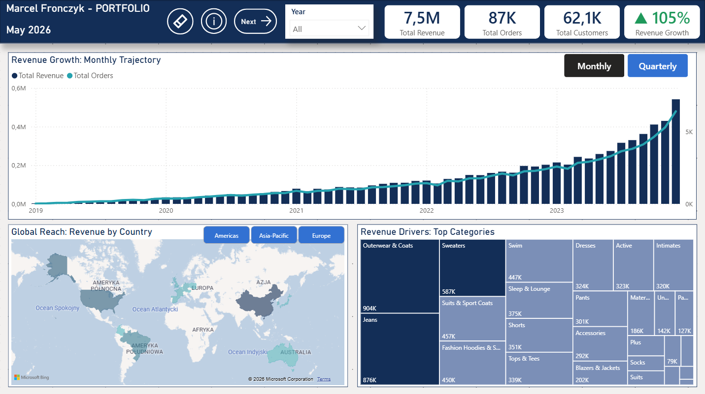

---

## Table of Contents

1. [Executive Summary](#executive-summary)
2. [Project Origin & Business Context](#project-origin--business-context)
3. [Business Questions by Department](#business-questions-by-department)
4. [Tech Stack & Pipeline](#tech-stack--pipeline)
5. [Dataset Overview](#dataset-overview)
6. [SQL Deep Dive](#sql-deep-dive)
7. [Data Quality & Import Challenges](#data-quality--import-challenges)
8. [Data Model Decisions](#data-model-decisions)
9. [Dashboard Tour](#dashboard-tour)
10. [Key Insights & Recommendations](#key-insights--recommendations)
11. [Methodology & Conscious Decisions](#methodology--conscious-decisions)
12. [Limitations & Caveats](#limitations--caveats)
13. [Future Work](#future-work)
14. [Repository Structure](#repository-structure)
15. [Acknowledgments](#acknowledgments)
16. [Author](#author)

---

## Executive Summary

Six headline findings from analyzing 125K orders, 100K customers, and 491K inventory units across Jan 2019 – Dec 2023:

- **COVID-driven 238% revenue growth (2019→2020), sustained through 2023** — revenue scaled from $121K (2019) to $2.8M (2023), with no country recording a decline across the full period. Growth is volume-driven, not price-driven (avg item price stable at $59–60 every year), and geographically broad-based.

- **Business model signals point to marketplace / dropshipping operation** — top 10 products generate only 0.94% of revenue (extreme long tail), 74% of stock is old collection, and every traffic source delivers identical loyalty (1.39–1.41 orders per customer). theLook reads as a wide-catalog reseller, not a vertically integrated retailer.

- **Customer loyalty crisis: 76.6% buy only once, top 10% generates just 34.3% of revenue** versus industry norm 50–60%. Flat Pareto / Gini ~0.3–0.4 — revenue from breadth, not whales. Strategic implication: mid-tier customer activation beats VIP retention. Returning cohort rate grew organically from 0% (2019) to 20.3% (2023) without explicit campaigns.

- **Email channel reaches only 2,416 of 100K customers with emails on file** — largest single growth lever in the dataset. Combined with the marketplace pattern, this suggests systematic underinvestment in customer relationship infrastructure. **Recommendation:** email re-engagement campaign with discount codes targeting one-time buyers to clear old stock and build loyalty.

- **Operational inventory crisis: 74% of stock is old collection (pre-2023)** with $1.13M frozen in Jeans and $981K in Outerwear & Coats. Combined with 70.2% single-item orders, this signals two opportunities: bundling promotions (cross-sell mechanics) and discontinuation candidates (Jumpsuits, Clothing Sets — low margin + low volume).

- **Quality signal: 28.5% return rate** at the high end of industry range (20–30%); every single category exceeds the 25% benchmark, with Suits and Suits & Sport Coats leading at 31%. Combined with 39.6% Suits margin, this suggests systematic markdown / clearance pricing in that category.

---

## Project Origin & Business Context

This project was built with intentional discipline around how data analytics work is structured for executive consumption.

### Why this dataset

The dataset (originally **theLook eCommerce**, a fictional clothing retailer dataset from Google BigQuery public datasets, mirrored to GitHub by `recruit41/ecommerce-dataset` — since removed; preserved in `data/raw/` of this repository) was chosen for three reasons:

1. **Real-feeling messiness** — encoding issues (España duplicate countries), comma-in-name CSV bugs (26 rows in products, 400 in inventory_items), timezone artifacts in delivery dates (17% of order_items have shipped_at preceding created_at). These are problems that exist in production data and need to be documented and worked around — not curated away.

2. **5-year scope (Jan 2019 – Dec 2023)** — sufficient to model COVID disruption + recovery, year-over-year cohort dynamics, and multi-year inventory accumulation. Shorter datasets force toy analyses.

3. **Multi-department applicability** — the schema supports questions for C-Level, Sales & Product, Customer & Marketing, and Operations. This enables dashboard structure mirroring how a real business consumes analytics: by stakeholder, not by visualization type.

### Anti-tutorial framing

A common portfolio failure mode is **chart hunting** — opening the data and looking for "something interesting" to plot. This project deliberately avoided that pattern.

Instead, the project started with **18 executive-driven business questions** across 4 departments (see [Business Questions by Department](#business-questions-by-department)). Every visual in the dashboard answers a specific question. Every measure has a documented purpose. Every architectural decision has a written rationale.

This is the difference between a dashboard built **for stakeholders** versus a dashboard built **about data**.

### Methodology: CLEAN framework

Data exploration followed the **CLEAN framework** — a structured approach to analytics work:

- **C — Conceptualize the data:** initial exploration in Excel before any SQL load. Row counts, value ranges, key column distributions, null patterns, anomaly detection. This surfaced the comma-in-name CSV parsing bugs (26 rows in products, 400 in inventory_items) and the España encoding duplicate, which were then resolved at file level *before* BULK INSERT — saving downstream cleanup time.
- **L — Locate solvable problems:** documented data quality issues with explicit decisions (fix vs work around vs exclude). Examples: comma-in-name → manually fixed; shipped_at < created_at timezone artifact (17%) → excluded from time-based analysis but kept in volume aggregates; status filter convention to handle stale Shipped/Processing orders.
- **E — Engage with the question, not the data:** every visual answers a pre-defined business question (the 18 questions below). No "let me see what this column looks like" charts.
- **A — Analyze with methodology transparency:** every measure has a documented purpose; conscious decisions (dual-source convention, surgical CROSSFILTER, REMOVEFILTERS on inventory) are explained, not buried.
- **N — Narrate findings:** README as executive summary; info textboxes on each dashboard page; recommendations attached to findings, not just observations.

### Business model hypothesis

The project treats theLook as a fictitious operating company. Based on data signals, theLook reads as a **marketplace / dropshipping clothing retailer**, not a vertically integrated brand:

- **Top 10 products generate only 0.94% of revenue** — no flagship product portfolio, extreme long tail
- **~41% of catalog generates 80% of revenue** — much flatter than typical 20/80 Pareto, consistent with reselling many SKUs at low velocity each
- **74% of stock is old collection (pre-2023)** — suggests passive stock turnover, not active SKU lifecycle management typical of vertical retailers
- **All traffic sources show identical loyalty (1.39–1.41 orders per customer)** — channels don't differentiate customer behavior, which is unusual for vertically integrated brands that typically build channel-specific affinity (e.g., direct email loyalists vs paid acquisition one-timers)
- **Email reaches only 2.4% of customers despite full email coverage** — no built-out CRM infrastructure, also typical of marketplace operators relying on traffic acquisition

This hypothesis affects how findings are interpreted. For example, the 76.6% one-time buyer rate is **not a brand crisis** — it's structural to marketplace economics. The recommendation isn't "build loyalty programs" (vertical brand thinking) but rather "activate the unused CRM channel to convert one-time buyers via discount codes."

---

## Business Questions by Department

To avoid chart hunting, the project started with a structured list of business questions organized by department. These questions defined the dashboard architecture: each department became a page, and each visual on a page answers one or more questions.

### Summary

| # | Department | Question |
|---|---|---|
| 1 | Executive | What is the revenue trend across years? Sales anomalies, seasonality? |
| 2 | Executive | Which countries drive revenue and how is growth distributed geographically? |
| 3 | Executive | Which categories drive total revenue mix? |
| 4 | Executive | What is the customer repeat purchase rate trend? |
| 5 | Sales & Product | Which categories balance margin and volume best? |
| 6 | Sales & Product | What inventory is slow-moving and how much capital is frozen? |
| 7 | Sales & Product | What is the order composition — single vs multi-item? |
| 8 | Sales & Product | Where is the price sweet spot — volume vs revenue tradeoff? |
| 9 | Sales & Product | Top 10 vs long tail — how concentrated is revenue? |
| 10 | Customer & Marketing | How does customer value distribute — Pareto pattern? |
| 11 | Customer & Marketing | What is the demographic structure — age, country, gender, traffic source? |
| 12 | Customer & Marketing | Which traffic sources deliver loyal customers vs one-time buyers? |
| 13 | Customer & Marketing | Does traffic source affect return rate? |
| 14 | Customer & Marketing | How is the new vs returning customer mix trending? |
| 15 | Operations | What is the average delivery time and SLA performance? |
| 16 | Operations | What is the return rate by category and gender? Quality outliers? |
| 17 | Operations | Does delivery time correlate with return rate? |
| 18 | Operations | How is inventory turning over by category? |

### Department deep dives

<details>
<summary><strong>Executive (C-Level)</strong></summary>

<br>

**1. What is the revenue trend across years? Sales anomalies, seasonality?**

- **Answer:** Revenue scaled from $121K (2019) to $2.8M (2023), with a 238% acceleration in 2020 (COVID boom) sustained through 2023 with no year-over-year decline. Growth is volume-driven — average item price held stable at $59–60 every year.
- **Where in dashboard:** Hero combo chart on Executive Overview (Monthly / Quarterly Field Parameter toggle). Bars = revenue, line = orders. Parallel trajectories confirm volume-driven growth.


**2. Which countries drive revenue and how is growth distributed geographically?**

- **Answer:** China dominates at 34.6% of total revenue, followed by USA (22.6%) and Brazil (14.1%) — top 3 countries together cover ~71% of revenue. No country recorded a decline across the full 2019–2023 period — growth is geographically broad-based.
- **Where in dashboard:** Filled choropleth map on Executive Overview, with Region tile slicer (Americas · Asia-Pacific · Europe) for regional drill-down. Dark fill = high revenue.

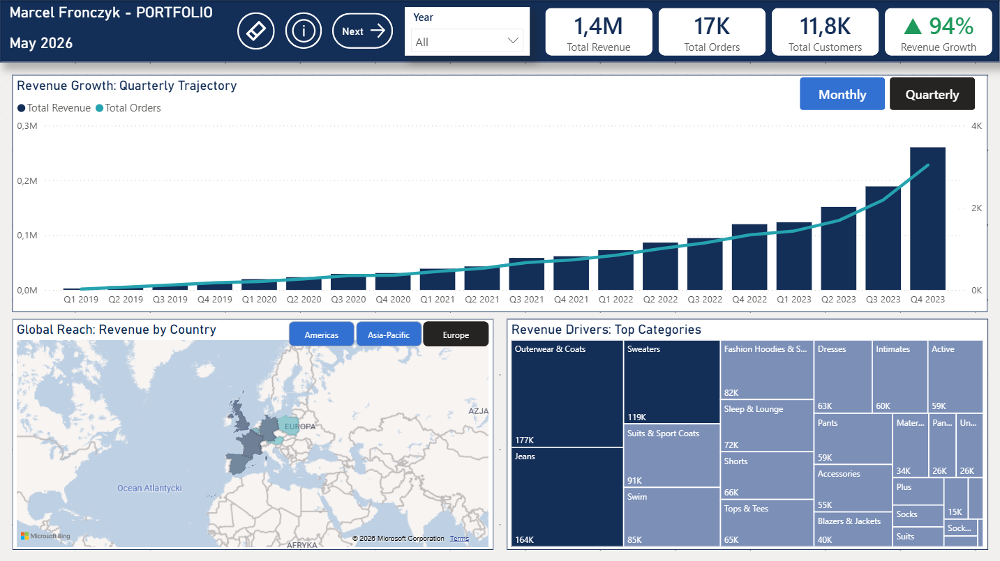

**3. Which categories drive total revenue mix?**

- **Answer:** Outerwear & Coats leads at $904K (12.2% share), followed by Jeans at $876K (11.7%). Treemap with conditional formatting highlights top 3 categories in deep navy to anchor reader attention.
- **Where in dashboard:** Revenue Drivers treemap on Executive Overview. Top 3 categories colored deep navy, others light navy — color convention matches the map's "dark = high revenue" semantic.

**4. What is the customer repeat purchase rate trend?**

- **Answer:** 76.6% of customers buy only once. Repeat purchase rate (cohort-based: customers with at least one order in any prior year) grew organically from 0% in 2019 to 20.3% by 2023 — broad-based customer acquisition with improving retention over time.
- **Where in dashboard:** Customer Retention static SQL visual on Customer & Marketing (BL). Year-over-year trend, not reactive to peer-visual cross-filtering by design (multi-year narrative preserved).

</details>

<details>
<summary><strong>Sales & Product</strong></summary>

<br>

**5. Which categories balance margin and volume best?**

- **Answer:** Blazers & Jackets have the highest margin (62%) but only 2.7% revenue share — undermarketed strategic asset. Jeans paradox: #2 revenue ($876K) but low margin (46.5%) — high volume masking weak profitability. Suits at 39.6% margin signal possible clearance pricing.
- **Where in dashboard:** Category Profitability scatter (TR) on Sales & Product. X = Total Items Sold, Y = Avg Margin %, bubble size = Total Revenue. Custom tooltip surfaces Avg Margin %, Revenue Share %, Total Items, Total Revenue per category.

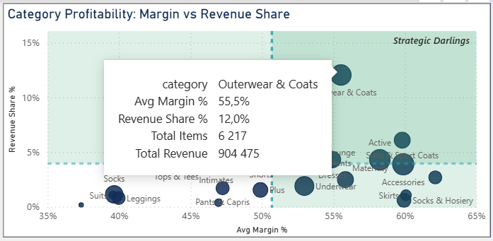

**6. What inventory is slow-moving and how much capital is frozen?**

- **Answer:** ~74% of all stock is old collection (added before 2023). Largest frozen capital: Jeans ($1.13M) and Outerwear & Coats ($981K). Inventory measures use `REMOVEFILTERS(dimDate)` since stock is a point-in-time snapshot, not time-series.
- **Where in dashboard:** Inventory Health TL on Sales & Product.

**7. What is the order composition — single vs multi-item?**

- **Answer:** 70.2% of orders are single-item — strong bundling opportunity. Suggests cross-sell mechanics (recommended pairings, bundle discounts) underdeveloped.
- **Where in dashboard:** Order Composition donut BL on Sales & Product.

**8. Where is the price sweet spot — volume vs revenue tradeoff?**

- **Answer:** $20–49 price bucket dominates volume (41.5%) but $50–99 delivers best revenue/volume balance — sweet spot for pricing strategy. **Premium tail ($200+) is only 4% of volume but contributes 17.1% of revenue** — disproportionately valuable per unit, worth protecting in promotional cycles.
- **Where in dashboard:** Price Bucket bar chart BR on Sales & Product.

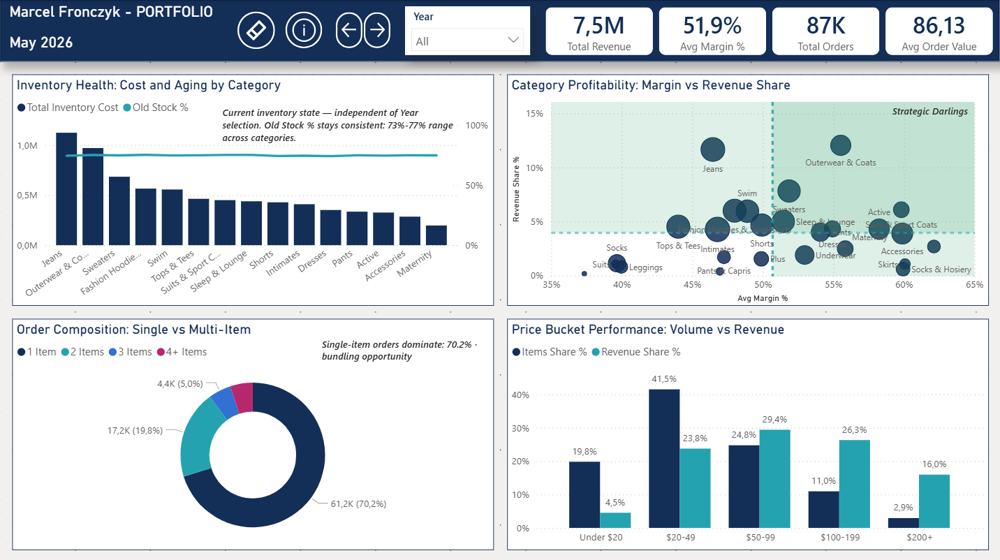

**9. Top 10 vs long tail — how concentrated is revenue?**

- **Answer:** Top 10 products generate only ~0.94% of revenue — extreme long-tail distribution consistent with a dropshipping or marketplace model. Roughly 41% of catalog generates 80% of revenue (much flatter than typical 20/80 Pareto).
- **Where in dashboard:** Inferred from Category Profitability scatter and SQL analysis — see SQL Deep Dive for the underlying query.

</details>

<details>
<summary><strong>Customer & Marketing</strong></summary>

<br>

**10. How does customer value distribute — Pareto pattern?**

- **Answer:** Top 10% of customers generate 34.3% of revenue versus industry norm 50–60%. Flat Pareto / Gini ~0.3–0.4 — revenue from breadth not whales. Strategic implication: mid-tier activation > VIP retention.
- **Where in dashboard:** Customer Pareto bar chart TR on Customer & Marketing. Static SQL output structure (decile_table), with reactive measures pulling from `query_customer_revenue_year` (Year-filtered customer revenue at day granularity).

**11. What is the demographic structure — age, country, gender, traffic source?**

- **Answer:** Age distribution remarkably flat at 8.4K–11.6K customers per bracket — no dominant demographic, broad assortment strategy confirmed. Country: China dominant. Gender: approximately balanced. Field Parameter dropdown lets viewer switch dimensions without rebuilding the visual.
- **Where in dashboard:** Total Customers by Demographic TL on Customer & Marketing, with Age / Country / Gender Field Parameter toggle.

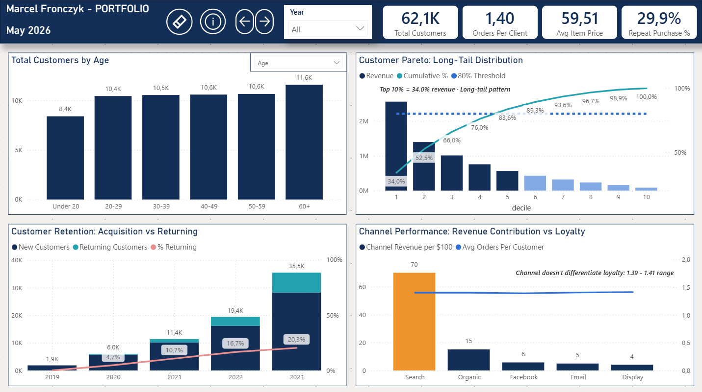

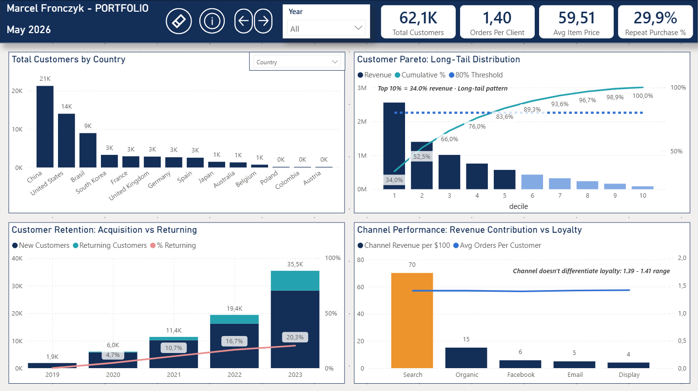

**12. Which traffic sources deliver loyal customers vs one-time buyers?**

- **Answer:** All traffic sources show identical loyalty (1.39–1.41 orders per customer) — channel choice doesn't differentiate repeat behavior. Email channel reaches only 2,416 customers of 100K with emails on file — largest untapped growth lever. Search dominates channel revenue contribution.
- **Where in dashboard:** Channel Performance bar chart BR on Customer & Marketing. Uses `Channel Revenue per $100` measure (decomposition of revenue across channels, sums to $100) — explicit anchor avoids AOV cognitive coupling. Search bar highlighted gold (`#ED942D`) as the dominant channel; others deep navy (`#132E57`).

**13. Does traffic source affect return rate?**

- **Answer:** No meaningful difference — all channels cluster at 14.7–15.6% return rate (within ±1 percentage point). Confirms that channel quality is not a return-rate driver; product/category quality is the dominant factor.
- **Where in dashboard:** Cross-referenced via Operations Quality Signal (TR) under traffic source filter context. SQL analysis surfaced the finding; visual confirmation through cross-filtering Channel Performance + Quality Signal.

**14. How is the new vs returning customer mix trending?**

- **Answer:** Returning customer cohort rate grew from 0% in 2019 (structural baseline — no prior years) to 20.3% by 2023. Year-over-year improvement in organic retention without explicit campaign intervention.
- **Where in dashboard:** Customer Retention stacked bar BL on Customer & Marketing. Static SQL output (`query_customers`), isolated from peer-visual cross-filtering — preserves multi-year narrative integrity.

</details>

<details>
<summary><strong>Operations</strong></summary>

<br>

**15. What is the average delivery time and SLA performance?**

- **Answer:** Avg delivery time 3.9 days, with 41.7% of orders delivered within 3-day SLA — majority falls just beyond threshold. Same Day delivery 1.3%, Next Day 7.4% — express fulfillment is a small but measurable segment. Note: 17% of order_items have data quality issues with delivery dates; analysis uses orders table directly (cleaner) with surgical CROSSFILTER for Year reactivity.
- **Where in dashboard:** Logistics Speed histogram TL on Operations. Dynamic annotation displays Same Day / Next Day percentages in Polish locale formatting.

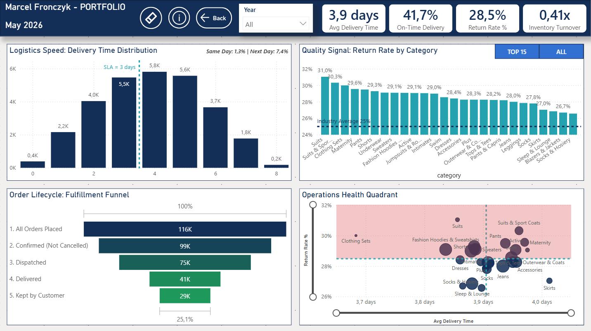

**16. What is the return rate by category and gender? Quality outliers?**

- **Answer:** Return rate 28.5% overall — at the high end of industry range (20–30%); every single category exceeds 25% benchmark. Suits and Suits & Sport Coats lead returns at 31% with low revenue — candidates for discontinuation. Gender breakdown: F 15.5%, M 15.3% — no meaningful difference. Return Rate uses censored data principle: denominator = Complete + Returned only (delivered orders that had time to be returned).
- **Where in dashboard:** Quality Signal bar chart TR + Operations Health Quadrant BR (scatter).

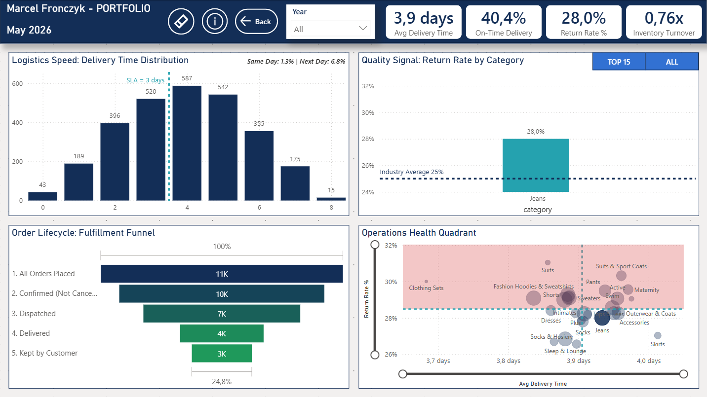

**17. Does delivery time correlate with return rate?**

- **Answer:** No clear correlation. Categories distribute across the quadrant without a discernible delivery-time → return-rate gradient. Returns are quality-driven (product/category-specific), not logistics-driven.
- **Where in dashboard:** Operations Health Quadrant BR. X = avg delivery time, Y = return rate, bubble size = revenue share. Top-right quadrant = high-risk categories. Lack of trend line confirms independence.

**18. How is inventory turning over by category?**

- **Answer:** Industry-standard formula: COGS proxy (sold order_items count) / Avg Inventory (unsold stock snapshot). Numerator reactive to Year filter, denominator constant via `REMOVEFILTERS(dimDate)`. Year-level turnover progression: 2019 (0.01x) → 2023 (0.21x) = 0.41x cumulative. Growth narrative visible in turnover acceleration.
- **Where in dashboard:** Inventory Turnover KPI on Operations + reactive to Quadrant BR category clicks.

</details>

---

## Tech Stack & Pipeline

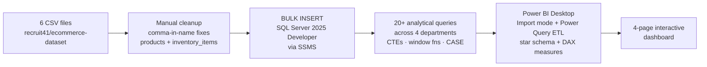

| Layer | Tool | Purpose |
|---|---|---|
| Storage | SQL Server 2025 Developer Edition (local instance) | Source of truth, transactional model |
| Querying | SSMS (SQL Server Management Studio) | Schema design, BULK INSERT, analytical SQL |
| ETL | Power Query M (in Power BI Desktop) | Date column conversion, calculated columns (Region, Date Only) |
| Modeling | Power BI Desktop, DAX | Star schema (1 snowflake element), 30+ measures |
| Visualization | Power BI Desktop | 4-page interactive dashboard with bookmarks, Field Parameters, custom tooltips |
| External tooling | Tabular Editor 2 (free) | Measure dependency analysis, model inspection |

**Connection mode: Import** (not DirectQuery) — chosen to support Power Query transformations and static SQL query results as separate tables (e.g., `decile_table`, `query_customers`, `query_customer_revenue_year`).

**Dashboard scope:** 4 pages · ~16 main visuals · 4 KPI cards per page · 30+ DAX measures · bookmark-driven info panels on every page · Field Parameter toggles on Executive (time granularity) and Customer & Marketing (demographic dimension).

---

## Dataset Overview

**Origin:** theLook eCommerce — a fictional clothing retailer dataset originally hosted as a public dataset in **Google BigQuery** (`looker-private-demo.thelook_ecommerce`). The dataset was mirrored to GitHub as CSV exports by `recruit41/ecommerce-dataset` (since removed). This repository preserves the CSV files in `data/raw/` and cleaned versions in `data/cleaned/` for reproducibility.

Six CSV tables totaling ~927K rows, 5 years of data, 14 countries post-cleanup.

| Table | Rows | Grain | Role |
|---|---|---|---|
| `orders` | 125,226 | One row per order | Fact-adjacent (linked via order_id) |
| `order_items` | 181,759 | One row per item within order | **Central fact table** |
| `products` | 29,120 | One row per SKU | Dimension |
| `users` | 100,000 | One row per customer | Dimension |
| `inventory_items` | 490,705 | One row per physical stock unit | Dimension (~309K unsold = current stock) |
| `distribution_centers` | 10 | One row per warehouse | Snowflake dimension via products |

**Date range:** January 2019 – December 2023 (5 full years)

**Countries:** 14 post-cleanup (Australia, Austria, Belgium, Brasil, China, Colombia, France, Germany, Japan, Poland, South Korea, Spain, United Kingdom, United States)

**Granularity choices:**
- Revenue analysis: `order_items.status IN ('Complete', 'Shipped', 'Processing')` — captures all delivered or in-flight value
- Return analysis: `Complete + Returned` (censored data principle)
- Time analysis: `orders.created_at_dt` for delivery analysis (cleaner than order_items.created_at due to 17% timezone artifact)

---

## SQL Deep Dive

<details>
<summary><strong>20+ analytical queries across 4 departments — click to expand</strong></summary>

<br>

### Why SQL was the right tool

Before any visualization work, the data needed to be **interrogated**, not just loaded. SQL was used as the primary analysis layer for three reasons:

1. **Aggregation efficiency** — questions like "top 10% customers' revenue share" or "year-over-year cohort progression" require grouping, window functions, and conditional aggregation that are expressed cleanly in SQL but become awkward in DAX with large row counts.

2. **Methodology transparency before visualization** — every query was constructed with documented intent (the question being answered), filter rationale (status convention, date range), and validation against multiple aggregations. Findings were captured in working notes before being translated into visuals — preventing the chart-hunting trap of "let me make a graph and see what it shows."

3. **Pre-validate findings before dashboarding** — building visuals to "discover" insights is backwards. SQL exploration surfaces what's interesting first, then visuals are designed to communicate confirmed findings to specific stakeholders.

### Techniques used

| Technique | Used for | Example questions |
|---|---|---|
| **CTEs (`WITH ... AS`)** | Multi-step logic, intermediate aggregates | Customer Pareto, returning customer cohort, top product concentration |
| **Window functions** (`NTILE`, `ROW_NUMBER`, `SUM() OVER`) | Ranking, decile bucketing, running totals | Decile assignment, cumulative revenue %, rank within category |
| **`CASE WHEN` segmentation** | Bucketing continuous values, conditional classification | Price buckets, age brackets, new vs returning customer flagging |
| **Date arithmetic** (`DATEDIFF`, `YEAR()`, `CAST AS DATE`) | Delivery time, year-over-year, seasonality | Avg delivery days, YoY growth, returning customer detection |
| **Multi-table JOINs** | Bringing facts and dimensions together | Revenue per category (orders × items × products), customer geography (orders × users) |
| **Conditional aggregation** (`SUM(CASE WHEN...)`, `COUNT(CASE WHEN...)`) | Slice metrics by status within one query | Return rate, on-time delivery %, status breakdown |
| **`NULLIF` and `COALESCE`** | Safe division, null handling | Margin % (avoid /0), category fallback for null fields |

### Featured query: Customer Pareto (decile distribution)

This query backs the **Customer Pareto TR visual** on Customer & Marketing. It demonstrates CTE chaining, window function bucketing, and nested aggregation:

```sql
WITH customer_revenue AS (
    SELECT 
        o.user_id, 
        ROUND(SUM(oi.sale_price), 2) AS customer_revenue
    FROM order_items oi
    JOIN orders o ON oi.order_id = o.order_id
    WHERE oi.status IN ('Complete', 'Shipped', 'Processing')
      AND YEAR(oi.created_at_dt) BETWEEN 2019 AND 2023
    GROUP BY o.user_id
),
ranked AS (
    SELECT 
        user_id, 
        customer_revenue,
        NTILE(10) OVER (ORDER BY customer_revenue DESC) AS decile
    FROM customer_revenue
)
SELECT 
    decile, 
    COUNT(user_id) AS customers,
    ROUND(SUM(customer_revenue), 2) AS total_revenue,
    ROUND(SUM(customer_revenue) * 100.0 
          / SUM(SUM(customer_revenue)) OVER (), 1) AS revenue_share_pct
FROM ranked
GROUP BY decile
ORDER BY decile;
```

**How it works:**

1. **CTE 1 (`customer_revenue`)** — aggregates lifetime revenue per customer, with status filter at order-item level.
2. **CTE 2 (`ranked`)** — uses `NTILE(10) OVER (ORDER BY ... DESC)` to bucket customers into 10 deciles ordered by revenue (decile 1 = top 10%).
3. **Final SELECT** — aggregates per decile and computes revenue share via `SUM() OVER ()` (nested aggregation: outer SUM is per-decile, inner SUM(SUM()) without partition gives the grand total used in the denominator).

The output (10 rows, one per decile) was then loaded into Power BI as a static SQL table (`decile_table`) — pre-aggregated at the right granularity for visualization, avoiding the need to replicate `NTILE` in DAX (which would require `RANKX` workarounds on 100K+ rows).

### Note on SQL artifact preservation

During the analysis phase, queries were authored interactively in SSMS — exploratory SQL with results validated in real time. Findings (revenue trends, category margins, customer Pareto, channel loyalty, return rates by category, etc.) were captured in working notes and translated directly into Power BI measures and static SQL outputs.

The Pareto query shown above is preserved verbatim. Three additional queries are preserved as **Power Query M source steps** inside the .pbix file (extractable via Power Query → Advanced Editor):

- `query_customer_revenue_year` — customer-day revenue aggregation, links to dimDate for Year-reactive Pareto measures
- `query_customers` — yearly new vs returning customer counts (powers Customer Retention BL visual)
- `decile_table` source query — customer revenue decile assignment (powers Customer Pareto TR visual)

Reconstruction of the full analytical query set as `.sql` files is on the future work list — would convert exploratory analysis into reproducible artifacts for repository consumers.

</details>

---

## Data Quality & Import Challenges

<details>
<summary><strong>Per-table findings, import technical issues, status filter convention — click to expand</strong></summary>

<br>

### Pre-import CSV cleanup (CLEAN Conceptualize phase)

Before any SQL load, each CSV was profiled in Excel for row counts, value ranges, null patterns, and structural anomalies. This phase surfaced issues that were resolved **at the file level** before BULK INSERT — saving downstream cleanup time.

### Per-table findings

#### `orders` (125,226 rows)

Cleanest fact-adjacent table. No date inversions (shipped → delivered sequence valid throughout). Used as the primary source for delivery time analysis precisely because of timestamp integrity.

#### `order_items` (181,759 rows) — the messiest table

- **30,649 rows (~17%) where `shipped_at` < `created_at`** — systematic timezone mismatch or data generation artifact. Not random noise; affects ~1 in 6 rows. **Decision:** rows kept in revenue/volume aggregates (the financial value is still legitimate), but `shipped_at` from this table excluded from time-based analysis. Delivery time analysis migrated to `orders` table instead.
- **4,663 rows where `delivered_at` < `created_at`** — additional date anomaly with same root cause. Flagged and excluded from delivery time calculations.
- **Status filter discovery** (see section below).

#### `products` (29,120 rows)

- **26 rows with comma-in-product-name causing CSV column spill** — product names contained commas that Excel interpreted as field separators (no text qualifier in original CSV). Manually fixed in CSV file before import.
- **3 rows with missing product name**; **7 rows with missing brand** — flagged but not removed (the underlying SKU is still valid; nulls handled in DAX via `BLANK()` checks).

#### `users` (100,000 rows)

Cleanest dimension table — **zero blank cells** across all rows. One issue:

- **España / Deutschland encoding artifact** — same country represented under two strings (Spanish localized name + English name). Resolved in SQL during table normalization via `CASE` statement remapping to canonical English form. Final country count: 14 distinct.

#### `inventory_items` (490,705 rows)

- **400 rows with comma-in-name bug** (same pattern as products, larger surface area). Manually fixed in CSV before import.
- **~181,759 rows marked as sold** (matching `order_items` volume — 1:1 relationship), **~309,000 rows unsold = current stock snapshot**. Sold/unsold split drove the "old collection" analysis (74% of unsold stock created before 2023).

#### `distribution_centers` (10 rows)

Clean. Single attribute table (warehouse names + geo coordinates). Used as snowflake side dimension via `products.distribution_center_id`.

### Import technical issues

- **Unix line endings** — CSVs had LF endings, not CRLF. Resolved by specifying `ROWTERMINATOR = '0x0a'` in BULK INSERT.
- **Polish Excel regional settings** — Polish locale uses semicolons as CSV separator and commas as decimal separator. Initial Excel re-saves corrupted the structure. **Workaround:** kept original CSVs unchanged where possible; for manually edited files (comma-in-name fixes), saved as CSV explicitly via "Save As → CSV UTF-8 (Comma delimited)" with locale override.
- **Date columns as NVARCHAR → DATETIMEOFFSET** — BULK INSERT could not parse the date format directly into DATETIMEOFFSET. Solution: import all date columns as `NVARCHAR`, then `ALTER TABLE` + `UPDATE` with explicit `CONVERT(DATETIMEOFFSET, original_column, 127)` to convert post-import. Original columns dropped after verification.
- **CSV vs Excel decision** — could have re-exported all data through Excel after cleanup, but kept original CSV path (faster, fewer encoding round-trips, BULK INSERT is the industry-standard pipeline).

### Status filter convention

A specific data quality issue with downstream impact on every revenue measure:

**Discovery:** during exploratory SQL, several orders from 2019–2021 retained `Shipped` or `Processing` status despite their dates clearly indicating completed transactions. These appeared to be data generation artifacts — the source process didn't backfill final statuses for older rows.

**Implication:** filtering revenue on `status = 'Complete'` alone would systematically undercount older years and distort YoY trends.

**Decision (revenue measures):**

```sql
WHERE status IN ('Complete', 'Shipped', 'Processing')
```

Includes all orders that represent legitimate transactional value, regardless of stale workflow state. Excludes `Cancelled` (no value) and `Returned` (refunded — net zero revenue, separate analysis).

**Decision (return rate measure):** different filter, applying censored data principle:

```sql
WHERE status IN ('Complete', 'Returned')
  AND delivered_at IS NOT NULL
```

Only counts returns against orders that **had time to be returned** (i.e., were delivered). Shipped and Processing orders are excluded from return rate denominators because they haven't yet entered the return-eligible state — including them would deflate the return rate by an artificial denominator inflation.

This dual-filter convention is documented in every measure that touches order status, and is mirrored in DAX via `CALCULATE(..., status IN ...)` filter arguments.

</details>

---

## Data Model Decisions

<details>
<summary><strong>Star schema, dual-source conventions, surgical CROSSFILTER, static SQL outputs — click to expand</strong></summary>

<br>

### Data model: star schema with snowflake element

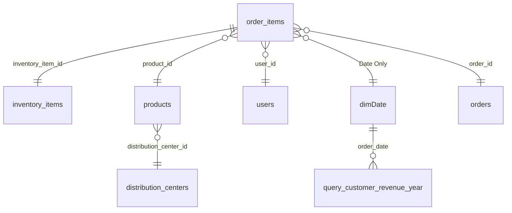

**`order_items` is the central fact table.** All transactional dimensions (`users`, `products`, `orders`, `inventory_items`, `dimDate`) hang off of it directly.

**Snowflake element justification:** `distribution_centers` (10 rows) connects to `products` via `distribution_center_id`, not directly to the fact table. This is intentional — a distribution center describes a **product's warehouse origin**, not a sale event. Attaching it to `products` keeps the relationship semantically clean and avoids redundant joins.

**`dimDate` is custom-built via DAX** (`CALENDAR(DATE(2019,1,1), DATE(2023,12,31))`) with calculated columns for Year, Month, Quarter, Year-Month, Year-Quarter, Day Name, Year-Month Date (first day of month for continuous time-axis charts), and sort-order helpers.

**`order_items` joins to `dimDate` via a `Date Only` column** added in Power Query (`Date.From([created_at_dt])`) to resolve a `DATETIMEOFFSET` vs `Date` type mismatch — relationships require matching data types on both sides.

**`order_items.inventory_item_id` ↔ `inventory_items.id` is 1:1** — each sold item corresponds to exactly one inventory unit, but ~309K inventory units remain unsold (no corresponding `order_items` row). This is intentional: unsold inventory_items represent current stock snapshot, queryable independently via `ISBLANK(inventory_items.sold_at)`.

### Auxiliary tables (no relationships)

These tables exist in the model but have no relationships — they serve specific architectural purposes:

| Table | Purpose | Architectural role |
|---|---|---|
| `_Measures` | DAX measure container | Hidden table holding all 30+ measures; standard Power BI organizational pattern |
| `decile_table` | Customer Pareto decile structure (10 rows) | Pre-aggregated SQL output; static decile axis for Pareto visual; no relationships so peer-visual clicks don't dissolve the structure |
| `query_customers` | New vs Returning Customers per year | Pre-aggregated SQL output; powers BL Customer Retention; isolated from peer-visual cross-filtering by design (multi-year narrative preserved) |
| `query_customer_revenue_year` | Customer revenue per day | Pre-aggregated SQL output linked **only** to `dimDate`; Year-reactive but peer-visual-isolated; powers Pareto reactive measures (% revenue, cumulative %, decile revenue) |
| `_Demography_parameter` | Field Parameter (Age / Country / Gender) | Drives the demographic dimension toggle on C&M TL visual |
| `OrderFunnel` | 5-step lifecycle structure (Placed → Non-Cancelled → Delivered → Not Returned → Kept) | Static lookup table powering Funnel visual on Operations BL |
| `Time Granularity` | Field Parameter (Monthly / Quarterly) | Drives the time granularity toggle on Executive hero combo chart |

### Dual-source measure conventions

A recurring architectural pattern: certain entities need to be counted **two different ways**, depending on whether Year reactivity is required.

#### Total Orders

```dax
Total Orders =                                  -- canonical, NOT Year-reactive
CALCULATE(
    COUNTROWS(orders),
    orders[status] IN { "Complete", "Shipped", "Processing" }
)

Total Orders (Item-Source) =                    -- Year-reactive variant
CALCULATE(
    DISTINCTCOUNT(order_items[order_id]),
    order_items[status] IN { "Complete", "Shipped", "Processing" }
)
```

- **Canonical version** sources from `orders` table (correct semantic — "orders" come from orders table). Used where Year reactivity is not required (e.g., AOV decomposition on C&M visual).
- **Item-Source version** sources from `order_items` table, which has the `Date Only → dimDate` relationship. Used in KPI cards and visuals requiring Year filter propagation.

#### Total Customers

```dax
Total Customers =                               -- Year-reactive
CALCULATE(
    DISTINCTCOUNT(order_items[user_id]),
    order_items[status] IN { "Complete", "Shipped", "Processing" }
)
```

`users[id]` would give a static 100K (all registered customers ever). Sourcing customer count from `order_items[user_id]` filtered by status gives **active customers within the Year filter context** — ~62K with all years selected.

### Surgical CROSSFILTER pattern (Operations measures)

Operations measures that aggregate from the `orders` table (delivery time, on-time %, funnel orders) face a propagation problem: the `orders` table has no direct relationship to `dimDate`. Year filter context propagates only through `order_items → dimDate` (the `Date Only` link).

To make `orders`-based measures Year-reactive, **surgical bidirectional CROSSFILTER** was applied inside `CALCULATE`:

```dax
Avg Delivery Time = 
CALCULATE(
    AVERAGE(orders[Delivery Days]),
    CROSSFILTER(order_items[order_id], orders[order_id], Both)
)
```

The CROSSFILTER directive opens the `order_items ↔ orders` relationship bidirectionally **only for this measure**, allowing the Year filter (which sits on `order_items` via `dimDate`) to propagate to `orders`.

**Why surgical, not global:** changing relationship cross-filter direction globally (in Model view) would break other measures by introducing ambiguity. Specifically, it broke `AOV per traffic_source` on C&M when tested. Surgical per-measure CROSSFILTER is the **good citizen** pattern — opens bidirectional only where needed, leaves the model relationships clean elsewhere.

Applied to: `Avg Delivery Time`, `On-Time Delivery %`, `Same Day Delivery %`, `Next Day Delivery %`, `Funnel Orders` (5 SWITCH branches).

### `REMOVEFILTERS(dimDate)` on inventory measures

Inventory is a **point-in-time snapshot**, not a time series. Filtering inventory by Year doesn't make sense — current stock is current stock.

```dax
Old Stock Value = 
CALCULATE(
    SUM(inventory_items[cost]),
    ISBLANK(inventory_items[sold_at]),
    inventory_items[created_at] < DATE(2023, 1, 1),
    REMOVEFILTERS(dimDate)
)
```

`REMOVEFILTERS(dimDate)` strips the Year filter context so the measure returns the same snapshot value regardless of Year slicer state. Applied to all inventory health KPIs and the Inventory Health visual on S&P.

**Inventory Turnover** uses split reactivity:

```dax
Inventory Turnover = 
DIVIDE(
    CALCULATE(                                  -- numerator: Year-reactive
        COUNTROWS(order_items),
        order_items[status] IN { "Complete", "Shipped", "Processing" }
    ),
    CALCULATE(                                  -- denominator: snapshot, Year-stripped
        COUNTROWS(inventory_items),
        ISBLANK(inventory_items[sold_at]),
        REMOVEFILTERS(dimDate)
    )
)
```

This mirrors the industry-standard formula (COGS / Avg Inventory) — numerator reacts to period, denominator is constant.

### Static SQL outputs — three distinct architectural roles

Three pre-aggregated SQL queries are loaded into Power BI as separate tables (Get Data → Advanced → SQL query). Each serves a **different architectural purpose**:

| Table | Relationships | Behavior |
|---|---|---|
| `decile_table` | **None** (fully isolated) | Provides static decile axis (1–10). Customer Pareto visual structure is preserved regardless of any filter — peer-visual clicks, Year slicer, anything. Pure presentation scaffolding. |
| `query_customers` | **None** (fully isolated) | Pre-aggregated new vs returning customer counts per year. Visual shows full 5-year arc regardless of any filter. Multi-year narrative is protected from accidental dissolution by user clicks. |
| `query_customer_revenue_year` | **dimDate only** (no fact table link) | Year-reactive (via dimDate) but peer-visual-isolated (no link to users/products). Pareto measures (% revenue, cumulative %, decile revenue) recalculate per Year filter but don't react to traffic source / category clicks. |

This pattern provides **partial reactivity** — useful for visuals that should respect global time context but resist peer-visual cross-filtering that would distort their narrative.

### Bookmark `Data` property OFF (info panel pattern)

Every page has an **info button** that toggles an information textbox via bookmark. By default, Power BI bookmarks capture **everything on the page** — including slicer state. This caused the Region tile slicer to revert to a stale state whenever the info button was clicked.

**Fix:** right-click each bookmark → uncheck **Data** property (keeps Display ON, Current Page ON).

```
Bookmark properties:
[X] Display       (visibility, position) — toggles textbox in/out
[ ] Data          (filters, slicers)     — does NOT touch user filter state
[X] Current page  — keeps bookmark page-bound
[X] All visuals   — applies to entire page
```

Same fix applied to the Channel Performance bar sort on C&M (a separate bookmark issue resolved by setting explicit Sort axis → value descending on the visual itself, independent of bookmarks).

### Connection mode: Import (vs DirectQuery)

Import mode was chosen over DirectQuery for three reasons:

1. **Power Query transformations** — Date.From conversion, Region calculated column, calculated columns for sorting. DirectQuery would require equivalent transformations to be expressed at the SQL layer or in T-SQL views.
2. **Static SQL outputs** — `decile_table`, `query_customers`, `query_customer_revenue_year` are pre-aggregated query results loaded as snapshot tables. DirectQuery would re-execute these queries on every visual interaction, defeating the architectural purpose.
3. **Performance** — Import compresses the full model into the .pbix file and uses VertiPaq engine for in-memory queries. For ~927K total rows across all tables, this is far faster than DirectQuery round-trips to SQL Server.

Trade-off accepted: data is not real-time (would need scheduled refresh). For a portfolio analytics project on a static dataset, this is the right trade.

</details>

---

## Dashboard Tour

<details>
<summary><strong>4-page interactive dashboard walkthrough — click to expand</strong></summary>

<br>

### Common page elements

Every page shares a consistent layout pattern. The **header island** contains:

- **Page title** with narrative subtitle (pattern: "Topic: Description vs Description")
- **Navigation buttons** — `Next →` on Page 1, `← Back` on Page 4, both arrows on Pages 2–3
- **Info button** — toggles the page's information textbox via bookmark. On click, the button morphs into an `X` (close) icon; clicking again hides the textbox and restores the underlying visual
- **Reset Slicers button** — clears Year (and Region on Executive) without disturbing visual cross-filter highlights (conscious scope decision; documented in Methodology section)
- **Year slicer** — Multi-select with `Ctrl+click`, "Select all" enabled. Default behavior = single-year (replaces selection); power-user behavior = multi-year (`Ctrl+click`)
- **KPI cards** — 4 KPIs per page, scoped to that department

Below the header, the **main canvas** uses a 2×2 grid layout (Executive Overview is the exception — uses a 3-visual layout with hero chart on top).

---

### Page 1 — Executive Overview

**Role:** Executive pulse. Top-line performance across revenue trajectory, geographic footprint, and category revenue mix. Built as the C-Suite entry point — answers should be visible within 5 seconds of opening.

**KPI panel:** Total Revenue · Total Customers · Total Orders · Revenue Growth YoY (with dynamic ▲/▼ arrow and green/red color coding via DAX measure with locale-aware format string)

**Main visuals:**

- **Hero combo chart (wide, top)** — Revenue Growth trajectory. Bars = revenue, line = orders. Monthly / Quarterly Field Parameter toggle with dynamic title (`"Revenue Growth: Monthly Trajectory"` / `"Revenue Growth: Quarterly Trajectory"`). Continuous X-axis (Year-Month Date column, no scrollbar issues).
- **Filled choropleth map (BL)** — country revenue. Color gradient: light teal `#D6F0EC` → dark navy/teal. Region tile slicer (Americas · Asia-Pacific · Europe) for regional drill.
- **Treemap (BR)** — Revenue Drivers by category. Top 3 categories highlighted in deep navy `#0A1F44`, rest in light navy `#7B8FB7` — semantic color match with map convention (dark = high revenue).

**Interactions:** Hero → KPIs only (Revenue Growth measure defended via SWITCH DAX from sub-year filter context). Map → all peers + KPIs. Treemap → all peers + KPIs. Region tile → all + KPIs.


---

### Page 2 — Sales & Product

**Role:** Product economics. Which categories drive revenue vs margin, inventory health, order composition, price tier performance.

**KPI panel:** 4 product-focused KPIs (Avg Order Value · Total Items Sold · Avg Margin % · Slow Stock Value or equivalent)

**Main visuals (2×2 grid):**

- **TL — Inventory Health** — frozen capital by category, with old-stock highlighting. `REMOVEFILTERS(dimDate)` applied (stock is time-independent).
- **TR — Category Profitability** — scatter chart. X = Total Items Sold, Y = Avg Margin %, bubble size = Total Revenue. **Custom tooltip page** surfaces Avg Margin %, Revenue Share %, Total Items, Total Revenue per category on hover.
- **BL — Order Composition** — donut chart. Single-item vs multi-item orders breakdown.
- **BR — Price Bucket** — bar chart. Volume vs revenue across price tiers ($0–19, $20–49, $50–99, $100–199, $200+).

**Interactions:** **Full mesh** — all 4 visuals cross-filter each other and KPIs. Behavioral segmentation reasoning: order composition (item count) and price bucket are *behavioral segments* (not pure operational state), so drill-down across visuals is analytically meaningful.

**Year slicer:** filters all visuals **except** Inventory Health (stock is a snapshot, not time-series).


---

### Page 3 — Customer & Marketing

**Role:** Customer base structure. Demographics, value distribution, acquisition vs retention trends, channel performance.

**KPI panel:** 4 customer-focused KPIs (Total Customers · Repeat Purchase Rate · Email Coverage % · AOV or equivalent)

**Main visuals (2×2 grid):**

- **TL — Total Customers by Demographic** — bar chart with **Field Parameter dropdown** (Age / Country / Gender). Switches the dimension without rebuilding the visual. Custom tooltip per dimension.
- **TR — Customer Pareto** — decile bar chart. **Static SQL output** structure (`decile_table`, no relationships) with **reactive measures** (% revenue, cumulative % revenue, decile revenue) sourced from `query_customer_revenue_year`. Year-reactive but peer-visual-isolated.
- **BL — Customer Retention** — stacked bar of new vs returning customers per year. **Static SQL output** (`query_customers`, no relationships) — fully isolated from any filter so the 5-year arc is always visible.
- **BR — Channel Performance** — bar chart of `Channel Revenue per $100` (decomposition measure, sums to $100 across channels). Search highlighted gold `#ED942D`, others deep navy `#132E57` via conditional formatting measure.

**Interactions:** TL ↔ BR bidirectional (cross-filter each other + KPIs). TR and BL **architecturally isolated** (no relationships to fact tables) — peer-visual clicks don't propagate to them, preserving their multi-year narratives by design.


---

### Page 4 — Operations

**Role:** Fulfillment efficiency and product quality. Delivery speed distribution, return rates by category, order lifecycle attrition, category-level operations health.

**KPI panel:** 4 operations-focused KPIs (Avg Delivery Time · Return Rate % · On-Time Delivery % · Inventory Turnover)

**Main visuals (2×2 grid):**

- **TL — Logistics Speed** — histogram of delivery day distribution (0, 1, 2, 3, 4, 5+ days). Dynamic annotation displays Same Day / Next Day percentages with Polish locale formatting.
- **TR — Quality Signal** — bar chart of return rate by category. **TOP 15 / ALL toggle** switches between focused and full category view.
- **BL — Fulfillment Funnel** — 5-step lifecycle (Placed → Non-Cancelled → Delivered → Not Returned → Kept). **Custom tooltip page** shows Funnel Orders, % of First, % of Previous, Drop-off vs Previous per step.
- **BR — Operations Health Quadrant** — scatter chart. X = avg delivery time, Y = return rate, bubble size = revenue share. Top-right quadrant = high-risk categories (slow + returns-heavy).

**Interactions:** TR and BR are dimensional sources (category) — Filter all peers + KPIs on click. TL and BL are value sources (delivery day buckets, funnel steps — operational state, not segmentation) — value clicks isolated, do not reshape other visuals.

**Year slicer:** filters all visuals via **surgical CROSSFILTER** in DAX measures (`orders`-based measures including delivery time, on-time %, same-day/next-day %, funnel orders).


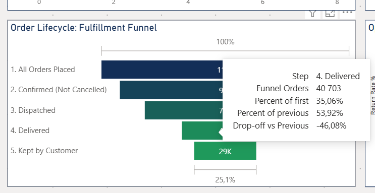

</details>

---

## Key Insights & Recommendations

<details>
<summary><strong>Strategic findings, operational findings, prioritized recommendations — click to expand</strong></summary>

<br>

### Strategic findings

1. **Marketplace / dropshipping business model** — extreme long-tail product distribution (top 10 SKUs = 0.94% revenue), passive inventory aging, channel-undifferentiated customer behavior. theLook is a wide-catalog reseller, not a vertical brand. Findings should be interpreted through marketplace economics, not vertical retail playbooks.

2. **Volume-driven growth, not premium pricing** — 238% revenue acceleration in 2020 sustained through 2023 with avg item price perfectly flat at $59–60. Growth was geographic and demographic breadth, not category mix upgrade or price action.

3. **Flat customer Pareto** — top 10% generates only 34.3% of revenue versus industry 50–60%. Revenue from breadth, not whales. Strategic implication: customer acquisition cost (CAC) optimization beats lifetime value (LTV) optimization for this business — get more mid-tier customers, don't try to over-extract from existing ones.

4. **CRM infrastructure gap** — 100K customers with emails on file, only 2,416 reached. Largest untapped lever in the dataset. The fact that all channels show identical loyalty (1.39–1.41 orders/customer) confirms there's no CRM moat — competitors could match this with basic email marketing.

### Operational findings

5. **Inventory crisis** — 74% of stock is old collection (pre-2023), with $1.13M frozen in Jeans and $981K in Outerwear & Coats. Independent of category — systemic stock rotation problem, not a category-specific issue.

6. **Quality signal across categories** — 28.5% overall return rate at the high end of industry range (20–30%); **every single category exceeds 25%**. Suits and Suits & Sport Coats lead at 31%. Combined with 39.6% Suits margin (low), clearance pricing is plausible explanation.

7. **No quality-logistics correlation** — categories distribute across the Operations Health Quadrant without a discernible "slow delivery → more returns" pattern. Returns are quality-driven (product fit, materials, expectations), not logistics-driven. Investment in faster delivery would not move return rates.

8. **Bundling opportunity** — 70.2% single-item orders. Cross-sell mechanics (recommended pairings, bundle discounts) underdeveloped. Cheaper to lift AOV via bundling than to acquire new customers.

### Prioritized recommendations

| # | Recommendation | Rationale | Effort |
|---|---|---|---|
| 1 | **Email re-engagement campaign with discount codes targeting one-time buyers** | Activates the unused 97.6% of email-eligible customers; clears old stock + builds repeat behavior; lowest cost intervention with largest data-supported upside | Low |
| 2 | **Discontinue Jumpsuits, Clothing Sets, possibly Suits** | Low margin + low revenue share + high return rate (Suits 31%); frozen capital that won't recover via natural sales velocity | Medium |
| 3 | **Bundle promotion mechanics** | 70.2% single-item orders represent immediate AOV upside; cheaper than acquisition | Medium |
| 4 | **Marketing investment in Blazers & Jackets** | Highest margin in catalog (62%) but only 2.7% revenue share — undermarketed strategic asset; potential premium-tier anchor | Low–Medium |
| 5 | **Old-collection markdown event** | $1.13M frozen in Jeans, $981K in Outerwear — turn capital that's locked anyway; do not protect prices on stock that hasn't moved in 12+ months | Low |

</details>

---

## Methodology & Conscious Decisions

<details>
<summary><strong>Architectural choices, conscious rejections, design conventions — click to expand</strong></summary>

<br>

This section documents **decisions that could have gone other ways**, with rationale. Every decision below was made deliberately, not by default.

### Architectural decisions

- **Dual-source measure convention (Total Orders, Total Customers)** — canonical version sources from dimension table (semantically correct, not Year-reactive); reactive version sources from fact table (`order_items`, propagates Year filter). Used where the same business entity needs to behave differently depending on filter context.
- **Surgical CROSSFILTER, not global bidirectional** — opened relationship direction inside `CALCULATE` per measure, kept relationships single-direction at model level. Tried global bidirectional once; it broke `AOV per traffic_source` on C&M by introducing ambiguity. Surgical is the good citizen pattern.
- **`REMOVEFILTERS(dimDate)` on inventory measures** — inventory is a point-in-time snapshot, not time-series. Year filter doesn't semantically apply. Applied to all stock-level measures + Inventory Health visual + Inventory Turnover denominator.
- **Static SQL outputs as architectural isolation tools** — three pre-aggregated tables (`decile_table`, `query_customers`, `query_customer_revenue_year`), each with a distinct relationship topology serving a specific visual behavior (fully isolated / Year-reactive but peer-isolated). Static loading via Get Data → Advanced, not DirectQuery.
- **Import mode over DirectQuery** — Power Query transformations + static SQL outputs require Import; performance benefits for a ~927K row model justify the loss of real-time refresh.
- **`Date Only` calculated column in Power Query** — resolved `DATETIMEOFFSET` vs `Date` type mismatch when linking fact table to dimDate. Type matching is mandatory for Power BI relationships.
- **Censored data principle for Return Rate** — denominator restricted to `Complete + Returned` (delivered orders), excluding `Shipped + Processing` which haven't entered the return-eligible state. Standard statistical practice when measuring rates of an event with a time lag.

### Visual & UX decisions

- **Narrative title pattern** — every page uses `Topic: Description vs Description` (e.g., "Channel Performance: Revenue Contribution vs Loyalty"). Conveys analytical framing in the title itself, not just the chart's data.
- **Color convention: dark = high revenue** — applied consistently across map (choropleth gradient) and treemap (top 3 deep navy, rest light navy). Cross-visual semantic consistency reduces cognitive load.
- **Gold accent (`#ED942D`) reserved for "highest" markers** — Search bar on Channel Performance (highest), top decile on Pareto. Used sparingly so the attention signal stays sharp.
- **Sort by value descending, not alphabetical** — applied explicitly on the visual (not via bookmark) so it survives bookmark interactions. Executive convention: highest bar on the left, eye flow natural from most important to least.
- **Bookmark `Data` property = OFF for info panels** — keeps Display ON (textbox visibility) but doesn't touch slicer/filter state. Without this, info button clicks reverted Region tile slicer to stale state.
- **Reset Slicers (not "Clean View")** — clears only slicer selections, preserves visual cross-filter highlights. Tried converting to full "Clean View" (clear everything); marginal benefit didn't justify reopening finalized pages. Documented as design choice.
- **Custom tooltips on key analytical visuals** — Category Profitability (margin %, revenue share, items, revenue), Fulfillment Funnel (orders, % first, % previous, drop-off). Standard tooltips would show only the data point's primary metric; custom tooltips deliver the analytical context that makes the visual interpretable.
- **Field Parameters with SWITCH-based dynamic titles** — uses the Order column (numeric) in SWITCH, not the label column (composite key error workaround). Reusable Power BI pattern.

### Conscious rejections (things deliberately *not* done)

- **DirectQuery** — rejected for this analytical use case (no real-time data need, Power Query transformations required, static SQL outputs needed).
- **Global bidirectional cross-filter** — tested, broke other measures via ambiguity. Replaced with surgical CROSSFILTER.
- **DAX `RANKX` for Pareto deciles** — would require iteration over 100K customer rows. Replaced with pre-aggregated SQL `NTILE` output loaded as static table.
- **"Reset all" button (clear visual cross-filter highlights)** — semantic scope kept narrow (Reset Slicers only). Documented above.
- **Status filter = Complete only** — would systematically undercount older years due to stale Shipped/Processing artifacts. Expanded to `Complete + Shipped + Processing` for revenue, `Complete + Returned` for return rate.
- **Pure star schema with `distribution_centers` linked directly to fact** — would be semantically wrong (warehouse describes product origin, not sale event). Kept snowflake link via `products`.
- **Pareto bullet in Executive Overview info textbox** — scope discipline; Pareto is a C&M finding, info textboxes describe per-page content only. Even though the finding is exec-relevant, cross-page contamination of info panels would hurt navigation clarity.

</details>

---

## Limitations & Caveats

<details>
<summary><strong>What this analysis does not cover — click to expand</strong></summary>

<br>

Honest framing of where this project stops:

- **Synthetic dataset** — theLook eCommerce is a fictitious / generated dataset. Patterns may reflect data generation choices rather than real-world e-commerce dynamics. Specifically suspect:
  - **Avg delivery time of 3.9 days** is unrealistically fast for a globally distributed retailer (real benchmarks 5–10 days). Likely a data generation simplification.
  - **China dominance (34.6% revenue)** is atypical for a clothing e-commerce site of this generic profile. Could be synthetic geographic bias.
  - **Perfect price stability ($59–60) across 5 years** suggests no real inflation modeling, which would be unrealistic for 2019–2023 inclusive of COVID supply chain disruption.

- **Data quality artifacts not removed** — 17% of `order_items` rows have `shipped_at < created_at`. Excluded from time-based analysis but kept in volume aggregates (decision documented). A production deployment would want this fixed at the data generation source.

- **No customer LTV / CAC analysis** — would require acquisition cost data (paid channel spend, organic acquisition cost imputation). Channel breakdown shows reach but not unit economics.

- **No predictive component** — pure descriptive analytics. No forecasting (e.g., 2024 revenue projection), no causal inference (e.g., "did the email channel cause repeat purchases or did repeat customers self-select into email"), no propensity modeling.

- **Category-level returns analysis only** — return rate is decomposed by category and gender but not by individual product. With 29K SKUs, product-level return analysis is feasible but adds noise without offsetting signal.

- **Inventory analysis is snapshot-based** — current stock as of dataset end. Historical inventory progression (how stock built up over time) not analyzed; would require event-sourced inventory deltas, which the dataset doesn't capture directly.

- **No real-time refresh** — Import mode means data is frozen at .pbix refresh time. A production deployment would need scheduled refresh or migration to DirectQuery (with the trade-offs documented above).

- **Static dashboard, no row-level security** — every viewer sees the same data. Real enterprise BI deployments typically restrict regional managers to their region, category leads to their categories, etc.

</details>

---

## Future Work

<details>
<summary><strong>Roadmap for v2 — click to expand</strong></summary>

<br>

- **Reconstruct exploratory SQL queries as `.sql` files** — during the analysis phase, queries were authored interactively in SSMS without persisted file artifacts. A future revision would extract the analytical patterns from chat history and dashboard measures, then publish them under `sql/` organized by department (`01_executive/`, `02_sales_product/`, etc.) for direct SQL skill demonstration without requiring viewers to open the .pbix file.

- **Cohort analysis page** — RFM segmentation (Recency, Frequency, Monetary), cohort survival curves, customer lifecycle stages. Would replace flat Pareto framing with a temporal customer journey lens.

- **Time series forecasting** — Power BI native forecast or Python integration (via Power Query Python script) to project 2024+ revenue, identify seasonal patterns, and quantify uncertainty bands.

- **Product-level return rate analysis** — drill below category to individual SKUs. Could surface specific defective products driving category-level signal.

- **Customer LTV / CAC modeling** — given acquisition cost assumptions, model expected lifetime revenue per channel and identify channels with positive unit economics.

- **Mobile / tablet layout optimization** — currently desktop-only layout. Power BI mobile view would benefit from a separate layout configuration for phone screens.

- **Bookmark-driven scenario comparison** — "what if we discontinued Jumpsuits?" toggle that shows revised inventory turnover, frozen capital, and revenue impact side by side with current state.

- **Talking points document** — interview prep manual similar to the one produced for the Job Market Intelligence project. Themed by 11 areas (project origin, data engineering, modeling, DAX patterns, dashboard UX, conscious rejections, etc.) with a quick-reference numbers cheat sheet.

</details>

---

## Repository Structure

```
ecommerce-analytics/
├── README.md                       # This file
├── data/
│   ├── raw/                        # Original CSV files (preserved from removed source)
│   │   ├── orders.csv
│   │   ├── order_items.csv
│   │   ├── products.csv
│   │   ├── users.csv
│   │   ├── inventory_items.csv
│   │   └── distribution_centers.csv
│   └── cleaned/                    # Post comma-in-name fixes (products, inventory_items)
├── images/                         # Dashboard screenshots
│   ├── executive-overview-1.png
│   ├── executive-overview-2.png
│   ├── sales-product-1.png
│   ├── sales-product-2.png
│   ├── customer-marketing-1.png
│   ├── customer-marketing-2.png
│   ├── operations-1.png
│   ├── operations-2.png
│   └── operations-3.png
└── powerbi/
    └── ecommerce-dashboard.pbix    # Full interactive dashboard
```

---

## Acknowledgments

**Dataset** originally sourced from `recruit41/ecommerce-dataset` (GitHub), which mirrored the **theLook eCommerce** public dataset from Google BigQuery (`looker-private-demo.thelook_ecommerce`). The recruit41 repository has been removed (404 as of June 2026); this project preserves the dataset in `data/raw/` for reproducibility and to maintain the underlying data layer publicly accessible.

**Tooling:**
- **SQL Server 2025 Developer Edition** + **SSMS** — free local SQL environment
- **Power BI Desktop** — free dashboard authoring tool
- **Tabular Editor 2** (free) — measure dependency analysis and model inspection during development

**Methodological framing** inspired by publicly available content on building executive-driven data portfolios — specifically the discipline of starting from business questions rather than data exploration, treating README files as executive summaries, and documenting conscious decisions (including rejections) as portfolio talking points.

---

## Author

**Marcel Fronczyk**

Corporate finance consultant transitioning into data analytics / BI roles. This is Portfolio Project #2.

- GitHub: [github.com/marcelFRO](https://github.com/marcelFRO)
- Portfolio Project #1: [AI-Powered Job Market Intelligence](https://github.com/marcelFRO/ai-job-market-intelligence)
