# Stakeholder-Driven E-Commerce Analytics

> End-to-end SQL Server → Power BI portfolio project analyzing 5 years of fictitious clothing e-commerce data across executive, product, customer, and operations departments. Built around three principles: executive-driven business questions first, methodology transparency throughout, and README as executive summary.

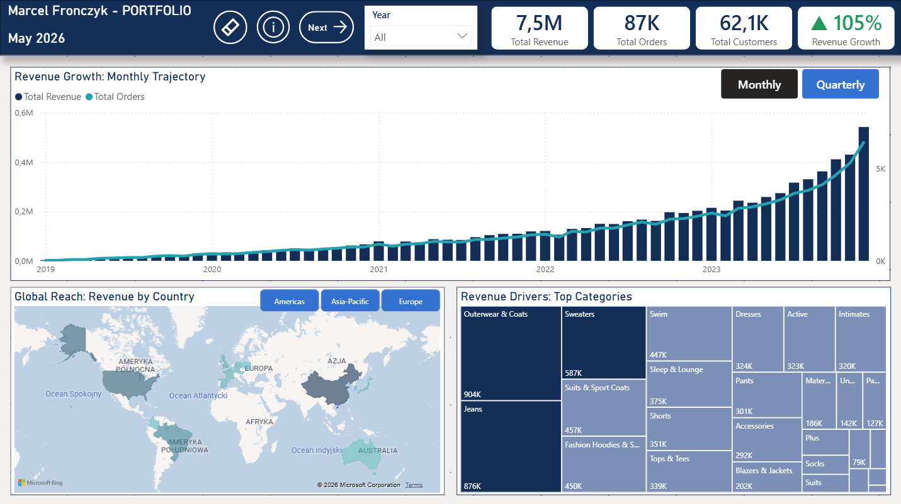

---

## At a Glance

| | |
|---|---|
| **Data scope** | 6 tables · 927K rows · 5 years (Jan 2019 – Dec 2023) · 14 countries |
| **Pipeline** | CSV → SQL Server 2025 → Power Query → Power BI Desktop |
| **Analytical depth** | 17 business questions · 20+ SQL queries · 30+ DAX measures |
| **Dashboard** | 4 pages · ~16 visuals · Field Parameter toggles · custom tooltips · bookmark navigation |
| **Methodology** | CLEAN framework · star schema · dual-source measure convention · surgical CROSSFILTER |
| **File size** | .pbix 21.9 MB (optimized from 53 MB initial — 59% reduction) |

---

## Table of Contents

1. [Executive Summary](#executive-summary)
2. [Project Origin & Business Context](#project-origin--business-context)
3. [Business Questions by Department](#business-questions-by-department)
4. [Tech Stack & Pipeline](#tech-stack--pipeline)
5. [Dataset Overview](#dataset-overview)
6. [SQL Deep Dive](#sql-deep-dive)
7. [Data Quality & Import Challenges](#data-quality--import-challenges)
8. [Data Model Decisions](#data-model-decisions)
9. [Dashboard Tour](#dashboard-tour)
10. [Key Insights & Recommendations](#key-insights--recommendations)
11. [Methodology & Conscious Decisions](#methodology--conscious-decisions)
12. [Limitations & Caveats](#limitations--caveats)
13. [Future Work](#future-work)
14. [Repository Structure](#repository-structure)
15. [Acknowledgments](#acknowledgments)
16. [Author](#author)

---

## Executive Summary

Six headline findings from analyzing 125K orders, 100K customers, and 491K inventory units across Jan 2019 – Dec 2023:

- **COVID-driven 238% revenue growth (2019→2020), sustained through 2023** — revenue scaled from $121K (2019) to $2.8M (2023), with no country recording a decline across the full period. Growth is volume-driven, not price-driven (avg item price stable at $59–60 every year), and geographically broad-based.

- **Business model signals point to wide-catalog multi-brand retailer with own inventory** — top 10 products generate only 0.97% of revenue (extreme long tail), 74% of stock is old collection, and every traffic source delivers identical loyalty (1.39–1.41 orders per customer). theLook reads as a long-tail aggregator carrying many brands across diverse categories, not a vertically integrated D2C brand.

- **Customer loyalty crisis: 76.6% buy only once, top 10% generates just 34.3% of revenue** versus industry norm 50–60%. Flat Pareto / Gini ~0.3–0.4 — revenue from breadth, not whales. Strategic implication: mid-tier customer activation beats VIP retention. Returning cohort rate grew organically from 0% (2019) to 20.3% (2023) without explicit campaigns.

- **Only 2,416 of 100K customers (2.4%) were acquired via Email channel** — despite all 100K customers having email addresses on file. The 97.6% acquired through other channels (Search, Organic, Facebook, Display) represents massive untapped re-engagement potential — the company never followed up these customers via email marketing despite having their addresses.

- **Inventory crisis: 21 of 26 categories have unsold stock cost exceeding their all-time revenue.** Worst relative ratios: Socks (161%), Clothing Sets (153%), Suits (152%), Leggings (144%). Largest absolute frozen capital: Jeans ($1.14M), Outerwear & Coats ($981K), Sweaters ($691K). Combined with 70.2% single-item orders, signals two opportunities: bundling promotions and discontinuation candidates from intersection of low margin + over-stocked categories (Clothing Sets, Suits, Leggings). *Note: the dollar amounts above come from a synthetic dataset and may not be realistic in absolute terms (see [Limitations](#limitations--caveats)). What's reliable is the relative comparison — which categories are more over-stocked vs healthier — not the raw frozen-capital figures.*

- **Quality signal: 28.5% return rate** at the high end of industry range (20–30%); every single category exceeds the 25% benchmark, with Suits and Suits & Sport Coats leading at 31%. Combined with 39.6% Suits margin, this suggests systematic markdown / clearance pricing in that category.

---

## Project Origin & Business Context

This project was built with intentional discipline around how data analytics work is structured for executive decision-making.

### Why this dataset

The dataset (originally **theLook eCommerce**, a fictional clothing retailer dataset from Google BigQuery public datasets, mirrored to GitHub by `recruit41/ecommerce-dataset` — since removed; preserved in `data/raw/` of this repository) was chosen for three reasons:

1. **Real-feeling messiness** — encoding issues (España duplicate countries), comma-in-name CSV bugs (26 rows in products, 400 in inventory_items), timezone artifacts in delivery dates (17% of order_items have shipped_at preceding created_at). These are problems that exist in production data and need to be documented and worked around — not curated away.

2. **5-year scope (Jan 2019 – Dec 2023)** — sufficient to model COVID disruption + recovery, year-over-year cohort dynamics, and multi-year inventory accumulation. Shorter datasets force toy analyses.

3. **Multi-department applicability** — the schema supports questions for C-Level, Sales & Product, Customer & Marketing, and Operations. This enables dashboard structure mirroring how a real business consumes analytics: by stakeholder, not by visualization type.

**Data lineage note (transparency):** this project began under the assumption that `recruit41/ecommerce-dataset` was an original GitHub-hosted dataset. Mid-project investigation revealed it was a CSV mirror of the well-known **theLook eCommerce** public dataset from Google BigQuery (`looker-private-demo.thelook_ecommerce`). By the time this was clear, the SQL Server import pipeline — including data quality remediation (comma-in-name fixes, encoding issues, NVARCHAR → DATETIMEOFFSET conversion) — was already established. Migrating to direct BigQuery access would have meant rebuilding the data layer for no analytical gain (the analysis is identical regardless of source). Surfacing this rather than retroactively framing it as a deliberate BigQuery rejection is part of the project's documentation discipline.

### Anti-tutorial framing

Two common portfolio failure modes work against analytical clarity: **chart hunting** — opening the data and looking for "something interesting" to plot, with no business question to anchor the work — and **analysis paralysis** — overthinking the project scope until forward momentum stops, typically driven by perfectionism, information overload, or fear of choosing the wrong angle. This project deliberately avoided both.

Instead, the project started with **17 executive-driven business questions** across 4 departments (see [Business Questions by Department](#business-questions-by-department)). Every visual in the dashboard answers a specific question. Every measure has a documented purpose. Every architectural decision has a written rationale. The bounded question set is itself the antidote to both pitfalls: chart hunting is impossible when every visual must answer a defined question, and analysis paralysis is avoided because scope is finite by design.

This is the difference between a dashboard built **for stakeholders** versus a dashboard built **about data**.

### Methodology: CLEAN framework

Data exploration followed the **CLEAN framework** — a structured approach to analytics work:

- **C — Conceptualize the data:** initial exploration in Excel before any SQL load — row counts, value ranges, key column distributions, null patterns, anomaly detection. This phase surfaced three categories of issues: (1) **comma-in-name CSV parsing bugs** (26 rows in products, 400 in inventory_items) — fixed in Excel at file level before BULK INSERT; (2) **date inversion artifacts** in order_items (~17% rows with `shipped_at` preceding `created_at`, plus 4,663 rows with `delivered_at` preceding `created_at`) — flagged for time-based analysis migration; (3) **encoding duplicates** (España/Spain, Deutschland/Germany — same country represented under localized vs English names) — normalized later during Power Query ETL step. Catching these upstream saved significant downstream cleanup time.
- **L — Locate solvable problems:** documented data quality issues with explicit decisions (fix vs work around vs exclude). Examples: comma-in-name → manually fixed at file level in Excel; date inversion artifacts in order_items (~17% rows with `shipped_at` < `created_at`, 4,663 rows with `delivered_at` < `created_at`) → time-based delivery analysis migrated to the orders table (timestamps clean there) while volume aggregates from order_items remained valid (financial value still legitimate, just timestamp columns unreliable); status filter convention to handle stale Shipped/Processing orders.
- **E — Engage with the question, not the data:** every visual answers a pre-defined business question (the 17 questions below). No "let me see what this column looks like" charts.
- **A — Analyze with methodology transparency:** every measure has a documented purpose; conscious decisions (dual-source convention, surgical CROSSFILTER, REMOVEFILTERS on inventory) are explained, not buried.
- **N — Narrate findings:** README as executive summary; info textboxes on each dashboard page; recommendations attached to findings, not just observations.

### Business model hypothesis

The project treats theLook as a fictitious operating company. Based on data signals, theLook reads as a **wide-catalog multi-brand online retailer** (long-tail aggregator model with own inventory), not a vertically integrated D2C brand:

- **Top 10 products generate only 0.97% of revenue** — no flagship product portfolio, extreme long tail
- **~44% of catalog generates 80% of revenue** — much flatter than typical 20/80 Pareto, consistent with reselling many SKUs at low velocity each
- **74% of stock is old collection (pre-2023)** — suggests passive stock turnover, not active SKU lifecycle management typical of vertical retailers
- **All traffic sources show identical loyalty (1.39–1.41 orders per customer)** — channels don't differentiate customer behavior, which is unusual for vertically integrated brands that typically build channel-specific affinity (e.g., direct email loyalists vs paid acquisition one-timers)
- **Email reaches only 2.4% of customers despite full email coverage** — no built-out CRM infrastructure, also typical of marketplace operators relying on traffic acquisition
- **Own inventory + warehouses** (490K stock units, 10 distribution centers, $2.1M frozen capital in slow categories) — rules out pure marketplace or dropshipping models, which wouldn't carry inventory risk

This hypothesis affects how findings are interpreted. For example, the 76.6% one-time buyer rate is **not a brand crisis** — it's structural to multi-brand retailer economics (customers loyal to brands carried, not to the platform). Conversely, the $2.1M frozen inventory is a **real and significant** capital problem precisely because the company carries its own stock — unlike marketplace operators who could simply delist slow SKUs at zero capital cost. The recommendation isn't "build loyalty programs" (vertical brand thinking) but rather "activate the unused CRM channel to convert one-time buyers via discount codes."

---

## Business Questions by Department

To avoid chart hunting, the project started with a structured list of business questions organized by department. These questions defined the dashboard architecture: each department became a page, and each visual on a page answers one or more questions.

### Summary

| # | Department | Question |
|---|---|---|
| 1 | Executive | What is the revenue trend across years? Sales anomalies, seasonality? |
| 2 | Executive | Which countries drive revenue and how is growth distributed geographically? |
| 3 | Executive | Which categories drive total revenue mix? |
| 4 | Sales & Product | Which categories balance margin and volume best? |
| 5 | Sales & Product | What inventory is slow-moving and how much capital is frozen? |
| 6 | Sales & Product | What is the order composition — single vs multi-item? |
| 7 | Sales & Product | Where is the price sweet spot — volume vs revenue tradeoff? |
| 8 | Sales & Product | Top 10 vs long tail — how concentrated is revenue? |
| 9 | Customer & Marketing | What is the customer repeat purchase rate trend? |
| 10 | Customer & Marketing | How does customer value distribute — Pareto pattern? |
| 11 | Customer & Marketing | What is the demographic structure — age, country, gender, traffic source? |
| 12 | Customer & Marketing | Which traffic sources deliver loyal customers vs one-time buyers? |
| 13 | Customer & Marketing | Does traffic source affect return rate? |
| 14 | Operations | What is the average delivery time and SLA performance? |
| 15 | Operations | What is the return rate by category and gender? Quality outliers? |
| 16 | Operations | Does delivery time correlate with return rate? |
| 17 | Operations | How is inventory turning over by category? |

### Department deep dives

<details>
<summary><strong>Executive (C-Level)</strong></summary>

<br>

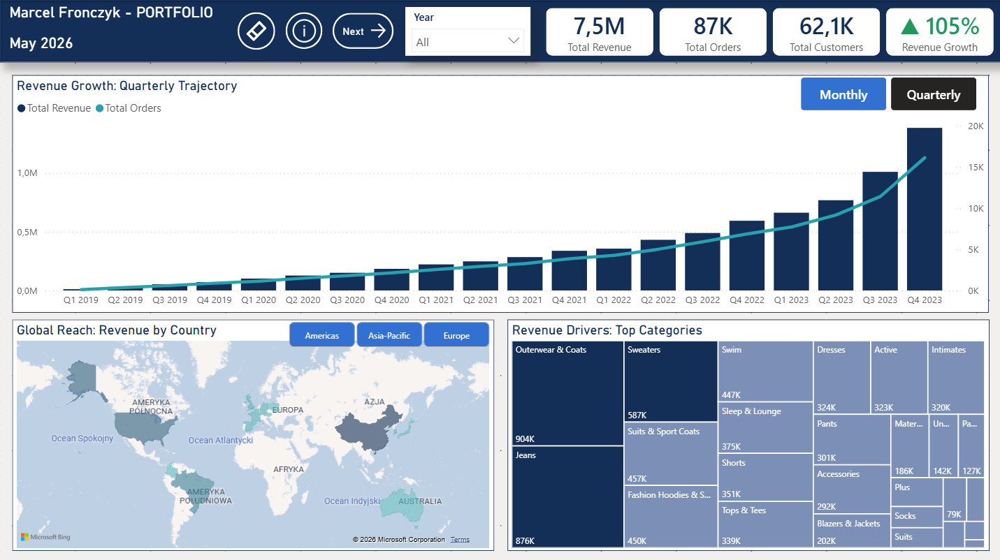

---

**1. What is the revenue trend across years? Sales anomalies, seasonality?**

- **Answer:** Revenue scaled from $121K (2019) to $2.8M (2023), with a 238% acceleration in 2020 (COVID boom) sustained through 2023 with no year-over-year decline. Growth is volume-driven — average item price held stable at $59–60 every year.
- **Seasonality:** No strong year-to-year seasonality is apparent in this dataset — the growth trajectory dominates within-year patterns, making clean seasonality detection difficult without normalizing each month against its year's average (seasonal indexing). Two patterns survive this caveat: (1) from 2021 onwards (after the business stabilized past initial ramp-up), February revenue dips 5–17% from January every year — likely reflecting post-holiday spending fatigue and a completed winter wardrobe cycle, with momentum recovering in March; (2) December peaks above November in every year of the dataset (5/5), averaging ~19% above the prior month — consistent with Christmas-driven retail seasonality on top of the broader growth trajectory.
- **Where in dashboard:** Hero combo chart on Executive Overview (Monthly / Quarterly Field Parameter toggle). Bars = revenue, line = orders. Parallel trajectories confirm volume-driven growth.

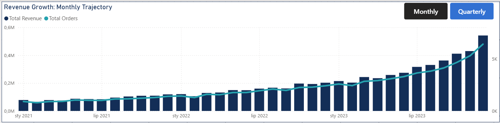

**2. Which countries drive revenue and how is growth distributed geographically?**

- **Answer:** China dominates at 34.6% of total revenue, followed by USA (22.6%) and Brazil (14.1%) — top 3 countries together cover ~71% of revenue. No country recorded a decline across the full 2019–2023 period — growth is geographically broad-based.
- **Where in dashboard:** Filled choropleth map on Executive Overview, with Region tile slicer (Americas · Asia-Pacific · Europe) for regional drill-down. Dark fill = high revenue. Hover tooltip shows Total Revenue, Total Customers, and Total Orders per country.

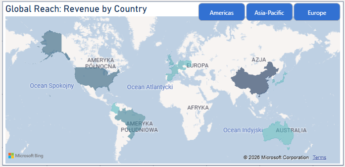

**3. Which categories drive total revenue mix?**

- **Answer:** Outerwear & Coats leads at $904K (12.2% share), followed by Jeans at $876K (11.7%). Treemap with conditional formatting highlights top 3 categories in deep navy to anchor reader attention.
- **Where in dashboard:** Revenue Drivers treemap on Executive Overview. Top 3 categories colored deep navy, others light navy — color convention matches the map's "dark = high revenue" semantic. Hover tooltip shows Total Revenue, Total Items, Revenue Share %, and Avg Margin % per category.

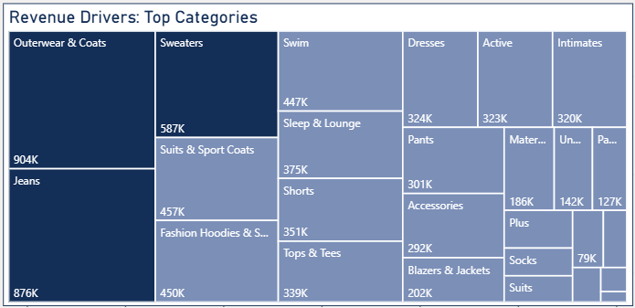

</details>

<details>
<summary><strong>Sales & Product</strong></summary>

<br>

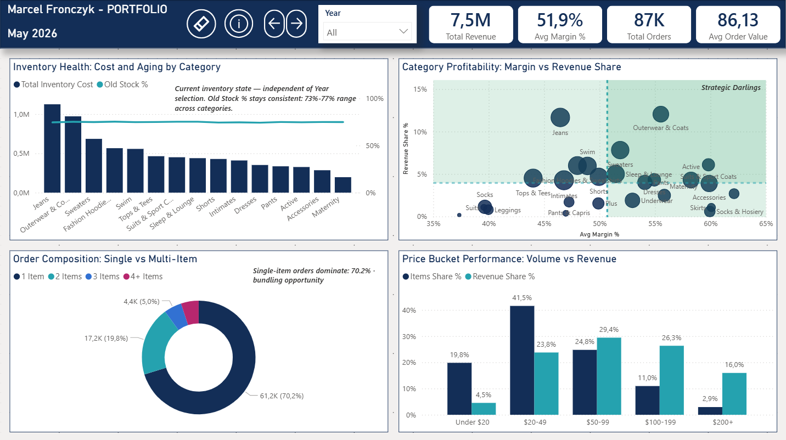

---

**4. Which categories balance margin and volume best?**

- **Answer:** The scatter functions as a **2×2 portfolio matrix** (margin × revenue share):
  - **Top-right "Strategic Darlings"** — high margin × high share, the ideal investment quadrant.
  - **Top-left (volume-driven)** — high share × lower margin. **Jeans paradox** at 46.5% margin × ~12% share ($876K revenue) — volume masking weak profitability.
  - **Bottom-right (niche profitable)** — high margin × low share. **Blazers & Jackets** lead at 62.1% margin × 2.7% share — combined with best inventory health (94.5%, see Q5) and limited 560-SKU catalog, the strongest **catalog expansion candidate** (see Strategic Finding #7 in Key Insights).
  - **Bottom-left (discontinuation candidates)** — low margin × low share. **Suits** at 39.6% margin + over-stocked at 152% inventory-to-revenue ratio (see Q5).
- **Where in dashboard:** Category Profitability scatter (TR) on Sales & Product. X = Avg Margin %, Y = Revenue Share %, bubble size = Total Items Sold. **Top-right quadrant labeled "Strategic Darlings"** (high margin × high revenue share — ideal categories to invest in). Custom tooltip surfaces Avg Margin %, Revenue Share %, Total Items, Total Revenue per category.

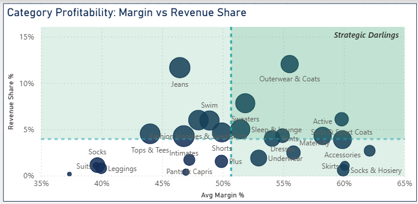

**5. What inventory is slow-moving and how much capital is frozen?**

- **Answer:** ~74% of all stock is old collection (added before 2023). 21 of 26 categories show unsold stock cost exceeding their all-time revenue — worst relative offenders: Socks (161%), Clothing Sets (153%), Suits (152%). Largest absolute frozen capital: Jeans ($1.14M), Outerwear & Coats ($981K), Sweaters ($691K). Inventory measures use `REMOVEFILTERS(dimDate)` since stock is a point-in-time snapshot, not time-series. *Note: absolute dollar values may be inflated by synthetic data generation; relative cross-category ratios are the robust analytical signal (see Limitations).*
- **Where in dashboard:** Inventory Health TL on Sales & Product. Dynamic annotation displays current state independent of Year selection: *"Old Stock % stays consistent: 73%–77% range across categories"* — communicates that inventory snapshot is time-independent (and that no single category escapes the broad stock-rotation problem).

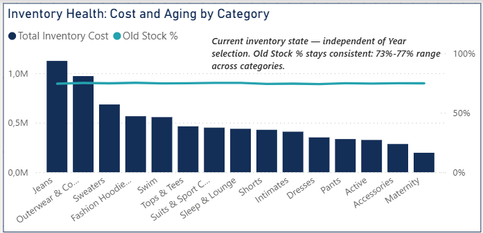

**6. What is the order composition — single vs multi-item?**

- **Answer:** 70.2% of orders are single-item — strong bundling opportunity. Suggests cross-sell mechanics (recommended pairings, bundle discounts) underdeveloped.
- **Where in dashboard:** Order Composition donut BL on Sales & Product. Dynamic annotation displays headline finding inline: *"Single-item orders dominate: 70.2% · bundling opportunity"* — translates raw distribution into actionable framing (visual doesn't just show what is — it points to what to do).

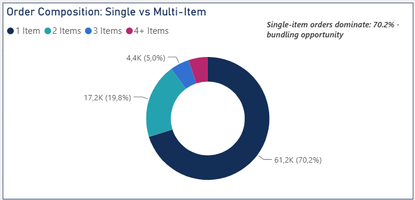

**7. Where is the price sweet spot — volume vs revenue tradeoff?**

- **Answer:** $20–49 price bucket dominates volume (41.5%) but $50–99 delivers best revenue/volume balance — sweet spot for pricing strategy. **Premium tail ($200+) is only 4% of volume but contributes 17.1% of revenue** — disproportionately valuable per unit, worth protecting in promotional cycles.
- **Where in dashboard:** Price Bucket bar chart BR on Sales & Product.

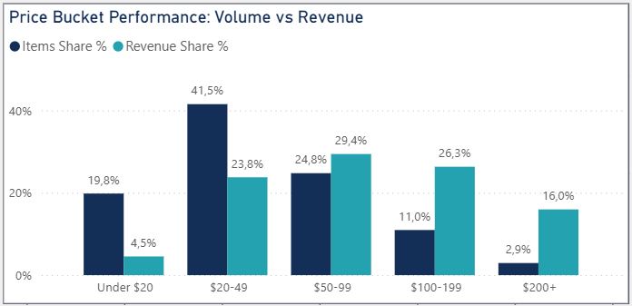

**8. Top 10 vs long tail — how concentrated is revenue?**

- **Answer:** Top 10 products generate only **0.97%** of revenue — extreme long-tail distribution consistent with a multi-brand wide-catalog retailer model (e.g., online department store, fashion aggregator). Reaching 80% of revenue requires the top **12,585 products (~44% of the 28,709 catalog)** — much flatter than typical 20/80 Pareto.

    | Product rank bucket | Product count | Revenue share |
    |---|---|---|
    | Top 10 | 10 | 0.97% |
    | Top 11–100 | 90 | 3.84% |
    | Top 101–1,000 | 900 | 16.03% |
    | Top 1,001–5,000 | 4,000 | 31.54% |
    | Rest (5,001+) | 23,709 | 47.63% |

    Even the top 100 products combined account for under 5% of revenue. The top 1,000 reach only ~21%. This is the signature of long-tail commerce, not vertical brand economics.
- **Where in dashboard:** No single dashboard visual answers this directly — finding is from SQL analysis (Product Pareto bucket query, see [SQL Deep Dive](#sql-deep-dive)). Indirectly visible on the Category Profitability scatter where large categories don't resolve into individual "hero products."

</details>

<details>
<summary><strong>Customer & Marketing</strong></summary>

<br>

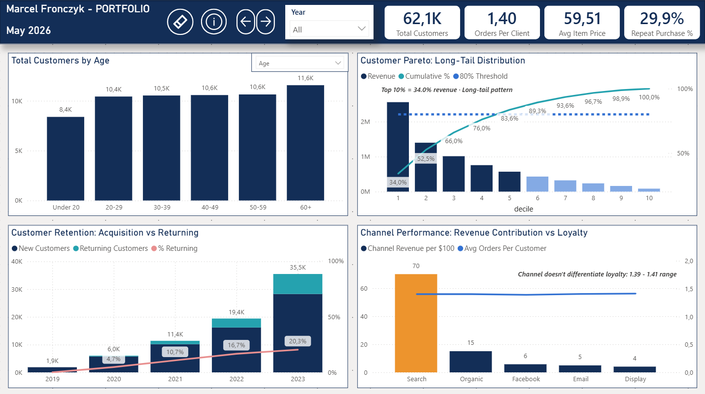

---

**9. What is the customer repeat purchase rate trend?**

- **Answer:** 76.6% of customers buy only once at lifetime level. However, repeat purchase rate (cohort-based: customers with at least one order in any prior year) grew organically from 0% in 2019 (structural baseline — no prior years) to 20.3% by 2023 — year-over-year improvement in organic retention achieved without explicit campaign intervention. Broad-based customer acquisition with improving retention over time.
- **Where in dashboard:** Customer Retention static SQL visual on Customer & Marketing (BL). Year-over-year trend, not reactive to peer-visual cross-filtering by design (multi-year narrative preserved).

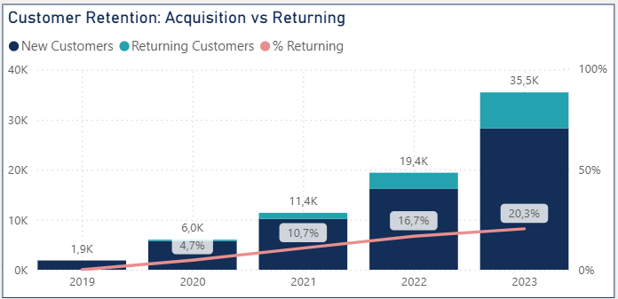

**10. How does customer value distribute — Pareto pattern?**

- **Answer:** Top 10% of customers generate 34.3% of revenue versus industry norm 50–60%. Flat Pareto / Gini ~0.3–0.4 — revenue from breadth not whales. Strategic implication: mid-tier activation > VIP retention.
- **Where in dashboard:** Customer Pareto bar chart TR on Customer & Marketing. Static SQL output structure (decile_table), with reactive measures pulling from `query_customer_revenue_year` (Year-filtered customer revenue at day granularity). Dynamic annotation displays headline finding inline: *"Top 10% = 34.0% revenue · Long-tail pattern"* — anchors the visual in the takeaway (decile 1's contribution) so reader doesn't have to compute the share manually.

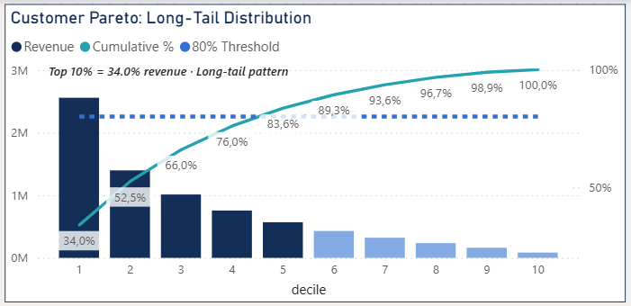

**11. What is the demographic structure — age, country, gender, traffic source?**

- **Answer:** Age distribution remarkably flat at 8.4K–11.6K customers per bracket — no dominant demographic, broad assortment strategy confirmed. Country: China dominant. Gender: approximately balanced. Field Parameter dropdown lets viewer switch dimensions without rebuilding the visual.
- **Where in dashboard:** Total Customers by Demographic TL on Customer & Marketing, with Age / Country / Gender Field Parameter toggle.

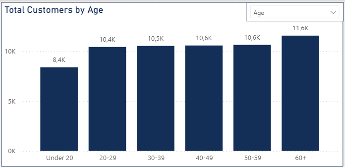

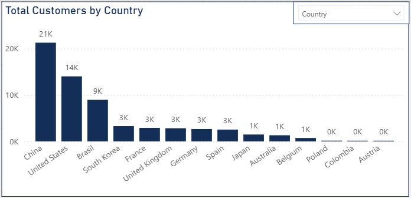

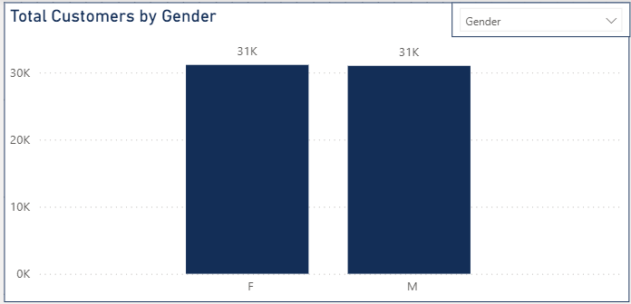

**12. Which traffic sources deliver loyal customers vs one-time buyers?**

- **Answer:** All traffic sources show identical loyalty (1.39–1.41 orders per customer) — channel choice doesn't differentiate repeat behavior. Only 2,416 customers (2.4%) were acquired via Email channel, despite all 100K customers having email addresses on file — the 97.6% reached via other channels represents untapped email re-engagement potential. For per-channel revenue contribution breakdown, see Q13.
- **Where in dashboard:** Channel Performance bar chart BR on Customer & Marketing. Uses `Channel Revenue per $100` measure (decomposition of revenue across channels, sums to $100) — explicit anchor avoids AOV cognitive coupling. Search bar highlighted gold (`#ED942D`), others deep navy (`#132E57`). Dynamic annotation displays loyalty finding inline: *"Channel doesn't differentiate loyalty: 1.39 - 1.41 range"* — visual shows revenue differences across channels, annotation surfaces the counter-intuitive loyalty parity (different acquisition shares, identical retention).

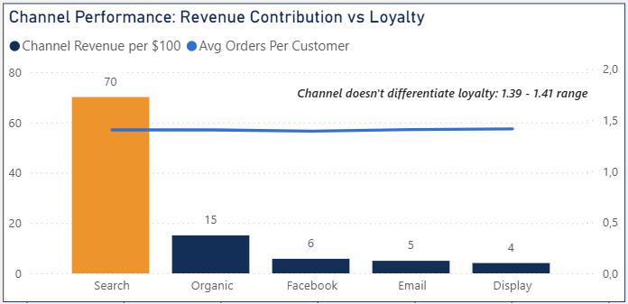

**13. Which acquisition channel generates the most revenue contribution — and what does this say about channel efficiency?**

- **Answer:** Search dominates raw revenue contribution: per $100 of channel-attributed revenue, Search generates $70.06, with Organic at $15.09, Facebook at $5.78, Email at $4.98, and Display at $4.09. **But the strategic implication is not "scale Search further" — it's that low-cost channels are dramatically underutilized.** Search dominance comes paired with paid acquisition costs (cost-per-click); Email's $4.98 contribution is achieved at **near-zero marginal cost** (sending to existing customer base); Facebook's $5.78 is largely from organic posts (only Facebook Ads carry real cost). Combined with Q12's finding that all channels deliver identical customer loyalty (1.39–1.41 orders per customer), the cost-efficiency conclusion is clear: **Email and Facebook are the high-ROI growth levers, not Search**. Email is especially underutilized — 100K customers have email addresses on file (registration data) but only 2,416 (2.4%) were acquired via this channel. Expanding email and Facebook outreach likely delivers higher marginal ROI than further investment in paid Search, where diminishing returns on CAC are inevitable at this scale of dominance.
- **Strategic synthesis:** Email's role extends beyond cost-efficiency — a single promotional program (discount codes, bundle offers) addresses three structural problems concurrently (76.6% one-time buyers Q9, 70.2% single-item orders Q6, inventory bloat Q5). Three KPIs from three departments lifted through one low-cost intervention. See **Strategic Finding 5** in [Key Insights](#key-insights--recommendations) for full discussion.
- **Where in dashboard:** Channel Performance bar chart BR on Customer & Marketing — same visual supports Q12. Uses `Channel Revenue per $100` measure (decomposition of revenue across channels, sums to $100 — explicit anchor avoids AOV cognitive coupling). Search bar highlighted gold (`#ED942D`); others deep navy (`#132E57`).

</details>

<details>
<summary><strong>Operations</strong></summary>

<br>

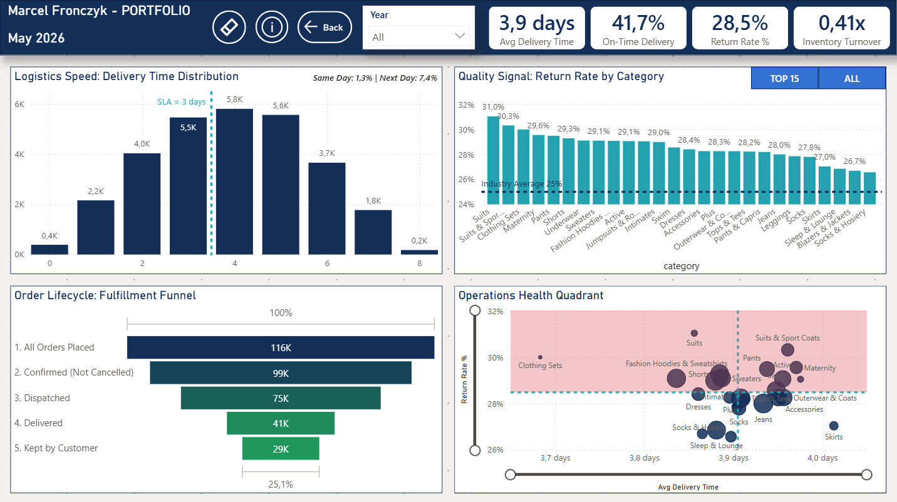

---

**14. What is the average delivery time and SLA performance?**

- **Answer:** Avg delivery time 3.9 days, with 41.7% of orders delivered within 3-day **Service Level Agreement (SLA)** target — majority falls just beyond threshold. Same Day delivery 1.3%, Next Day 7.4% — express fulfillment is a small but measurable segment. Note: 17% of order_items have data quality issues with delivery dates; analysis uses orders table directly (cleaner) with surgical CROSSFILTER for Year reactivity.
- **Where in dashboard:** Logistics Speed histogram TL on Operations. Dynamic annotation displays headline finding inline: *"Same Day: 1,3% | Next Day: 7,4%"* — surfaces the small-but-measurable express fulfillment segment that bars alone would understate.

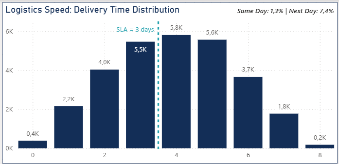

**15. What is the return rate by category and gender? Quality outliers?**

- **Answer:** Return rate 28.5% overall — at the high end of industry range (20–30%); every single category exceeds 25% benchmark. Suits and Suits & Sport Coats lead returns at 31% with low revenue — candidates for discontinuation. Gender breakdown: F 15.5%, M 15.3% — no meaningful difference. Return Rate uses censored data principle: denominator = Complete + Returned only (delivered orders that had time to be returned).
- **Where in dashboard:** Quality Signal bar chart TR + Operations Health Quadrant BR (scatter). Both visuals expose category-level return rate — Quality Signal as raw bar ranking, Quadrant as bubble plot combining delivery time × return rate % × revenue share. Quality Signal includes **TOP 15 / ALL toggle** — two separate buttons programmed via bookmarks that swap visual focus between the 15 worst-return-rate categories (focused decision view) and all 26 categories (full distribution view).

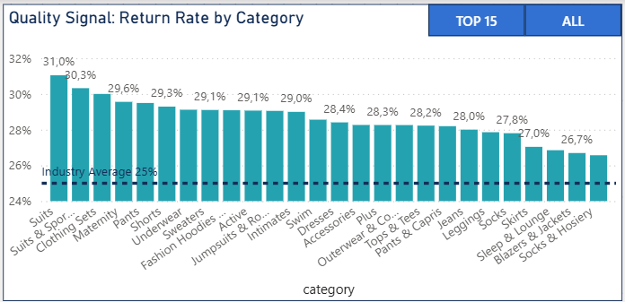

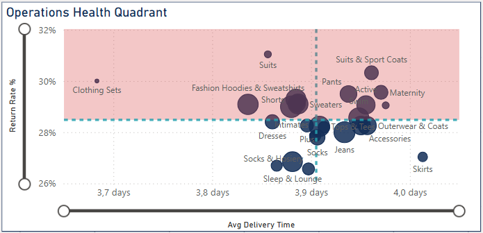

**16. Does delivery time correlate with return rate?**

- **Answer:** No clear correlation. Categories distribute across the quadrant without a discernible delivery-time → return-rate gradient. Returns are quality-driven (product/category-specific), not logistics-driven. See Operations Health Quadrant above (Q15) — visual confirms lack of trend.
- **Where in dashboard:** Operations Health Quadrant BR (shown under Q15). X = avg delivery time, Y = return rate, bubble size = revenue share. Top-right quadrant = high-risk categories. Lack of trend line confirms independence.

**17. How is inventory turning over by category?**

- **Answer:** Industry-standard formula: COGS proxy (sold order_items count) / Avg Inventory (unsold stock snapshot). Numerator reactive to Year filter, denominator constant via `REMOVEFILTERS(dimDate)`. Year-level turnover progression: 2019 (0.01x) → 2023 (0.21x) = 0.41x cumulative. Growth narrative visible in turnover acceleration.
- **Where in dashboard:** Inventory Turnover KPI on Operations + reactive to Quadrant BR category clicks (shown under Q15).

</details>

---

## Tech Stack & Pipeline

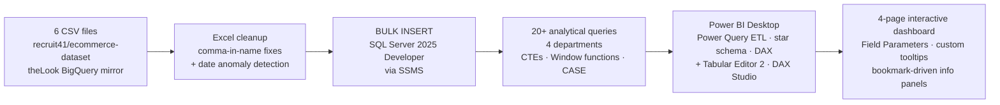
```mermaid
flowchart LR
    A[6 CSV files<br/>recruit41/ecommerce-dataset<br/>theLook BigQuery mirror] --> B[Excel cleanup<br/>comma-in-name fixes<br/>+ date anomaly detection]
    B --> C[BULK INSERT<br/>SQL Server 2025 Developer<br/>via SSMS]
    C --> D[20+ analytical queries<br/>4 departments<br/>CTEs · Window functions · CASE]
    D --> E[Power BI Desktop<br/>Power Query ETL · star schema · DAX<br/>+ Tabular Editor 2 · DAX Studio]
    E --> F[4-page interactive dashboard<br/>Field Parameters · custom tooltips<br/>bookmark-driven info panels]
```

| Layer | Tool | Purpose |
|---|---|---|
| Pre-import exploration | Microsoft Excel | Initial data profiling, file-level CSV cleanup (comma-in-name fixes in products and inventory_items), date anomaly detection during CLEAN Conceptualize phase |
| Storage | SQL Server 2025 Developer Edition (local instance) | Source of truth, transactional model |
| Querying | SSMS (SQL Server Management Studio) | Schema design, BULK INSERT, analytical SQL |
| ETL | Power Query M (in Power BI Desktop) | Date column conversion, encoding normalization (España/Deutschland), calculated columns (Region, Date Only) |
| Modeling | Power BI Desktop, DAX | Star schema (1 snowflake element), 30+ measures |
| Visualization | Power BI Desktop | 4-page interactive dashboard with bookmarks, Field Parameters, custom tooltips |
| External tooling | Tabular Editor 2 (free) + DAX Studio (free) | Measure dependency analysis, model inspection, VertiPaq column size analysis during final .pbix optimization (drove 53 MB → 21.9 MB size reduction) |

**Connection mode: Import** (not DirectQuery) — chosen to support Power Query transformations and static SQL query results as separate tables (e.g., `decile_table`, `query_customers`, `query_customer_revenue_year`).

**Dashboard scope:** 4 pages · ~16 main visuals · 4 KPI cards per page · 30+ DAX measures · bookmark-driven info panels on every page · Field Parameter toggles on Executive (time granularity) and Customer & Marketing (demographic dimension).

---

## Dataset Overview

**Origin:** theLook eCommerce — a fictional clothing retailer dataset originally hosted as a public dataset in **Google BigQuery** (`looker-private-demo.thelook_ecommerce`). The dataset was mirrored to GitHub as CSV exports by `recruit41/ecommerce-dataset` (since removed). This repository preserves the CSV files in `data/raw/` and cleaned versions in `data/cleaned/` for reproducibility.

Six CSV tables totaling ~927K rows, 5 years of data, 14 countries post-cleanup.

| Table | Rows | Grain | Role |
|---|---|---|---|
| `orders` | 125,226 | One row per order | Fact-adjacent (linked via order_id) |
| `order_items` | 181,759 | One row per item within order | **Central fact table** |
| `products` | 29,120 | One row per SKU | Dimension |
| `users` | 100,000 | One row per customer | Dimension |
| `inventory_items` | 490,705 | One row per physical stock unit | Dimension (~309K unsold = current stock) |
| `distribution_centers` | 10 | One row per warehouse | Snowflake dimension via products |

**Date range:** January 2019 – December 2023 (5 full years)

**Countries:** 14 post-cleanup (Australia, Austria, Belgium, Brasil, China, Colombia, France, Germany, Japan, Poland, South Korea, Spain, United Kingdom, United States)

**Granularity choices:**
- Revenue analysis: `order_items.status IN ('Complete', 'Shipped', 'Processing')` — captures all delivered or in-flight value. Three statuses (not just `Complete`) used because the dataset contains many older orders (2019–2021) still showing `Shipped` or `Processing` despite their dates clearly indicating completed transactions. This is a data generation artifact — the source process never backfilled final statuses for older rows. Restricting to `Complete` alone would systematically undercount older years and distort YoY trends. See [Data Quality & Import Challenges → Status filter convention](#data-quality--import-challenges) for full discussion.
- Return analysis: `Complete + Returned` (censored data principle — only counts returns against orders that had time to be returned, i.e., were delivered)
- Time analysis: `orders.created_at_dt` for delivery analysis (cleaner than order_items.created_at due to 17% timezone artifact + 4,663 delivered_at inversions)

---

## SQL Deep Dive

<details>
<summary><strong>20+ analytical queries across 4 departments — click to expand</strong></summary>

<br>

### Why SQL was the right tool

Before any visualization work, the data needed to be **interrogated**, not just loaded. SQL was used as the primary analysis layer for three reasons:

1. **Aggregation efficiency** — questions like "top 10% customers' revenue share" or "year-over-year cohort progression" require grouping, window functions, and conditional aggregation that are expressed cleanly in SQL but become awkward in DAX with large row counts.

2. **Methodology transparency before visualization** — every query was constructed with documented intent (the question being answered), filter rationale (status convention, date range), and validation against multiple aggregations. Findings were captured in working notes before being translated into visuals.

3. **Pre-validate findings before dashboarding** — SQL exploration surfaces what's interesting first, then visuals are designed to communicate confirmed findings to specific stakeholders.

### Techniques used

| Technique | Used for | Example questions |
|---|---|---|
| **Common Table Expressions (CTEs, `WITH ... AS`)** | Multi-step logic, intermediate aggregates | Customer Pareto, returning customer cohort, top product concentration |
| **Window functions** (`NTILE`, `ROW_NUMBER`, `SUM() OVER`) | Ranking, decile bucketing, running totals | Decile assignment, cumulative revenue %, rank within category |
| **`CASE WHEN` segmentation** | Bucketing continuous values, conditional classification | Price buckets, age brackets, new vs returning customer flagging |
| **Date arithmetic** (`DATEDIFF`, `YEAR()`, `CAST AS DATE`) | Delivery time, year-over-year, seasonality | Avg delivery days, YoY growth, returning customer detection |
| **Multi-table JOINs** | Bringing facts and dimensions together | Revenue per category (orders × items × products), customer geography (orders × users) |
| **Conditional aggregation** (`SUM(CASE WHEN...)`, `COUNT(CASE WHEN...)`) | Slice metrics by status within one query | Return rate, on-time delivery %, status breakdown |
| **`NULLIF` and `COALESCE`** | Safe division, null handling | Margin % (avoid /0), category fallback for null fields |

### Featured query #1: Customer Pareto (decile distribution)

This query backs the **Customer Pareto TR visual** on Customer & Marketing. It demonstrates CTE chaining, window function bucketing, and nested aggregation:

```sql
WITH customer_revenue AS (
    SELECT 
        o.user_id, 
        ROUND(SUM(oi.sale_price), 2) AS customer_revenue
    FROM order_items oi
    JOIN orders o ON oi.order_id = o.order_id
    WHERE oi.status IN ('Complete', 'Shipped', 'Processing')
      AND YEAR(oi.created_at_dt) BETWEEN 2019 AND 2023
    GROUP BY o.user_id
),
ranked AS (
    SELECT 
        user_id, 
        customer_revenue,
        NTILE(10) OVER (ORDER BY customer_revenue DESC) AS decile
    FROM customer_revenue
)
SELECT 
    decile, 
    COUNT(user_id) AS customers,
    ROUND(SUM(customer_revenue), 2) AS total_revenue,
    ROUND(SUM(customer_revenue) * 100.0 
          / SUM(SUM(customer_revenue)) OVER (), 1) AS revenue_share_pct
FROM ranked
GROUP BY decile
ORDER BY decile;
```

**How it works:**

1. **CTE 1 (`customer_revenue`)** — aggregates lifetime revenue per customer, with status filter at order-item level.
2. **CTE 2 (`ranked`)** — uses `NTILE(10) OVER (ORDER BY ... DESC)` to bucket customers into 10 deciles ordered by revenue (decile 1 = top 10%).
3. **Final SELECT** — aggregates per decile and computes revenue share via `SUM() OVER ()` (nested aggregation: outer SUM is per-decile, inner SUM(SUM()) without partition gives the grand total used in the denominator).

The output (10 rows, one per decile) was then loaded into Power BI as a static SQL table (`decile_table`) — pre-aggregated at the right granularity for visualization, avoiding the need to replicate `NTILE` in DAX (which would require `RANKX` workarounds on 100K+ rows).

### Featured query #2: Product Pareto (bucket breakdown)

This query backs the **Q8 long-tail finding** ([Sales & Product](#business-questions-by-department) — top 10 SKUs = 0.97% of revenue, top 100 = 4.81%, etc.). It demonstrates three SQL techniques in combination — CTEs, window functions, and `CASE WHEN` bucketing:

```sql
WITH product_revenue AS (
    SELECT 
        oi.product_id,
        SUM(oi.sale_price) AS product_revenue
    FROM order_items oi
    WHERE oi.status IN ('Complete', 'Shipped', 'Processing')
      AND YEAR(oi.created_at_dt) BETWEEN 2019 AND 2023
    GROUP BY oi.product_id
),
ranked AS (
    SELECT 
        product_id,
        product_revenue,
        ROW_NUMBER() OVER (ORDER BY product_revenue DESC) AS rank,
        COUNT(*) OVER () AS total_products,
        SUM(product_revenue) OVER () AS total_revenue,
        SUM(product_revenue) OVER (ORDER BY product_revenue DESC ROWS UNBOUNDED PRECEDING) AS cumulative_revenue
    FROM product_revenue
)
SELECT 
    CASE 
        WHEN rank <= 10 THEN 'Top 10'
        WHEN rank <= 100 THEN 'Top 11–100'
        WHEN rank <= 1000 THEN 'Top 101–1000'
        WHEN rank <= 5000 THEN 'Top 1001–5000'
        ELSE 'Rest'
    END AS bucket,
    COUNT(*) AS product_count,
    ROUND(SUM(product_revenue), 0) AS bucket_revenue,
    ROUND(SUM(product_revenue) * 100.0 / MAX(total_revenue), 2) AS revenue_share_pct
FROM ranked
GROUP BY 
    CASE 
        WHEN rank <= 10 THEN 'Top 10'
        WHEN rank <= 100 THEN 'Top 11–100'
        WHEN rank <= 1000 THEN 'Top 101–1000'
        WHEN rank <= 5000 THEN 'Top 1001–5000'
        ELSE 'Rest'
    END
ORDER BY MIN(rank);
```

**How it works:**

1. **CTE 1 (`product_revenue`)** — aggregates revenue per SKU, with the project-wide status filter convention (`Complete + Shipped + Processing` — see [Status filter convention](#data-quality--import-challenges)) and the 2019–2023 date range.
2. **CTE 2 (`ranked`)** — applies multiple window functions in a single pass:
   - `ROW_NUMBER() OVER (ORDER BY product_revenue DESC)` assigns each product a rank (1 = highest revenue)
   - `COUNT(*) OVER ()` and `SUM(product_revenue) OVER ()` (no partition, no ordering) give the total product count and grand total revenue across the entire result set — used as denominators in the final SELECT
   - `SUM(product_revenue) OVER (ORDER BY product_revenue DESC ROWS UNBOUNDED PRECEDING)` computes a running cumulative — for each row, sum of revenues from rank 1 through current rank. This pattern is the foundation of Pareto / 80-20 / running-share analysis.
3. **Final SELECT** — `CASE WHEN` buckets products by rank into 5 ranges (Top 10 / Top 11-100 / Top 101-1000 / Top 1001-5000 / Rest), then aggregates per bucket: product count, bucket revenue, and revenue share against the grand total.

The output (5 rows) is the exact table rendered in Q8's answer:

| Bucket | Products | Revenue share |
|---|---|---|
| Top 10 | 10 | 0.97% |
| Top 11–100 | 90 | 3.84% |
| Top 101–1,000 | 900 | 16.03% |
| Top 1,001–5,000 | 4,000 | 31.54% |
| Rest | 23,709 | 47.63% |

The 5-row output pre-computes the long-tail story in a portable shape — small enough to embed verbatim in the README, with all the analytical weight of the underlying 28,709-row dataset preserved in the bucket aggregates.

**Contrast with Customer Pareto query above:** Customer Pareto used `NTILE(10)` for decile bucketing (10 equal-sized buckets, equally spaced by rank). Product Pareto uses **rank-threshold bucketing via `CASE WHEN`** — buckets are size-uneven by design (Top 10 has 10 products, Rest has 23,709) to surface the extreme long-tail shape. Two different techniques for two different analytical questions: "how is customer value distributed by decile" vs "where does product revenue concentration break down".

### Note on SQL artifact preservation

During the analysis phase, queries were authored interactively in SSMS — exploratory SQL with results validated in real time. Findings (revenue trends, category margins, customer Pareto, channel loyalty, return rates by category, etc.) were captured in working notes and translated directly into Power BI measures and static SQL outputs.

Both Pareto queries shown above are preserved verbatim. Three additional queries are preserved as **Power Query M source steps** inside the .pbix file (extractable via Power Query → Advanced Editor):

- `query_customer_revenue_year` — customer-day revenue aggregation, links to dimDate for Year-reactive Pareto measures
- `query_customers` — yearly new vs returning customer counts (powers Customer Retention BL visual)
- `decile_table` source query — customer revenue decile assignment (powers Customer Pareto TR visual)

Reconstruction of the full analytical query set as `.sql` files is on the future work list — would convert exploratory analysis into reproducible artifacts for repository consumers.

</details>

---

## Data Quality & Import Challenges

<details>
<summary><strong>Per-table findings, import technical issues, status filter convention — click to expand</strong></summary>

<br>

### Pre-import CSV cleanup (CLEAN Conceptualize phase)

Before any SQL load, each CSV was profiled in Excel for row counts, value ranges, null patterns, and structural anomalies. This phase surfaced issues that were resolved **at the file level** before BULK INSERT — saving downstream cleanup time.

### Per-table findings

#### `orders` (125,226 rows)

Cleanest fact-adjacent table. No date inversions (shipped → delivered sequence valid throughout). Used as the primary source for delivery time analysis precisely because of timestamp integrity.

#### `order_items` (181,759 rows) — the messiest table

- **30,649 rows (~17%) where `shipped_at` < `created_at`** — systematic timezone mismatch or data generation artifact. Not random noise; affects ~1 in 6 rows. **Decision:** rows kept in revenue/volume aggregates (the financial value is still legitimate), but `shipped_at` from this table excluded from time-based analysis. Delivery time analysis migrated to `orders` table instead.
- **4,663 rows where `delivered_at` < `created_at`** — additional date anomaly with same root cause. Flagged and excluded from delivery time calculations.
- **Status filter discovery** (see section below).

#### `products` (29,120 rows)

- **26 rows with comma-in-product-name causing CSV column spill** — product names contained commas that Excel interpreted as field separators (no text qualifier in original CSV). Manually fixed in CSV file before import.
- **3 rows with missing product name**; **7 rows with missing brand** — flagged but not removed (the underlying SKU is still valid; nulls handled in DAX via `BLANK()` checks).

#### `users` (100,000 rows)

Cleanest dimension table — **zero blank cells** across all rows. One issue:

- **Encoding artifacts in country column** (España/Spain, Deutschland/Germany — localized names duplicating the same countries already represented in English). Resolved in Power Query during ETL via `Table.ReplaceValue` M function remapping to canonical English form. Note: exploratory SQL queries during analysis phase used `CASE WHEN` for the same purpose, but final data transformation happens in Power Query ETL layer. Final country count: 14 distinct.

#### `inventory_items` (490,705 rows)

- **400 rows with comma-in-name bug** (same pattern as products, larger surface area). Manually fixed in CSV before import.
- **~181,759 rows marked as sold** (matching `order_items` volume — 1:1 relationship), **~309,000 rows unsold = current stock snapshot**. Sold/unsold split drove the "old collection" analysis (74% of unsold stock created before 2023).

#### `distribution_centers` (10 rows)

Clean. Single attribute table (warehouse names + geo coordinates). Used as snowflake side dimension via `products.distribution_center_id`.

### Import technical issues

- **Unix line endings** — CSVs had LF endings, not CRLF. Resolved by specifying `ROWTERMINATOR = '0x0a'` in BULK INSERT.
- **Polish Excel regional settings** — Polish locale uses semicolons as CSV separator and commas as decimal separator. Initial Excel re-saves corrupted the structure. **Multi-step workaround:** (1) kept original CSVs unchanged where possible; (2) for manually edited files (comma-in-name fixes), saved as CSV explicitly via "Save As → CSV UTF-8 (Comma delimited)" with locale override; (3) for files requiring locale-format conversion that Excel mangled, opened in Notepad and used **bulk find-replace** on dots and commas to bypass Excel's locale-driven parsing — Notepad treats content as raw text without locale interpretation, so global replace operations execute cleanly.
- **Date columns as NVARCHAR → DATETIMEOFFSET** — BULK INSERT could not parse the date format directly into DATETIMEOFFSET. Solution: import all date columns as `NVARCHAR`, then `ALTER TABLE` + `UPDATE` with explicit `CONVERT(DATETIMEOFFSET, original_column, 127)` to convert post-import. Original columns dropped after verification.
- **CSV vs Excel decision** — could have re-exported all data through Excel after cleanup, but kept original CSV path (faster, fewer encoding round-trips, BULK INSERT is the industry-standard pipeline).

### Status filter convention

A specific data quality issue with downstream impact on every revenue measure:

**Discovery:** during exploratory SQL, several orders from 2019–2021 retained `Shipped` or `Processing` status despite their dates clearly indicating completed transactions. These appeared to be data generation artifacts — the source process didn't backfill final statuses for older rows.

**Implication:** filtering revenue on `status = 'Complete'` alone would systematically undercount older years and distort YoY trends.

**Decision (revenue measures):**

```sql
WHERE status IN ('Complete', 'Shipped', 'Processing')
```

Includes all orders that represent legitimate transactional value, regardless of stale workflow state. Excludes `Cancelled` (no value) and `Returned` (refunded — net zero revenue, separate analysis).

**Decision (return rate measure):** different filter, applying censored data principle:

```sql
WHERE status IN ('Complete', 'Returned')
  AND delivered_at IS NOT NULL
```

Only counts returns against orders that **had time to be returned** (i.e., were delivered). Shipped and Processing orders are excluded from return rate denominators because they haven't yet entered the return-eligible state — including them would deflate the return rate by an artificial denominator inflation.

This dual-filter convention is documented in every measure that touches order status, and is mirrored in DAX via `CALCULATE(..., status IN ...)` filter arguments.

</details>

---

## Data Model Decisions

<details>
<summary><strong>Star schema, dual-source conventions, surgical CROSSFILTER, static SQL outputs — click to expand</strong></summary>

<br>

### Data model: star schema with snowflake element

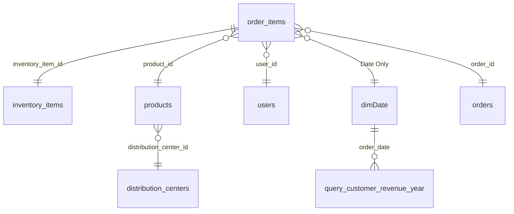
```mermaid
erDiagram
    order_items ||--|| inventory_items : "inventory_item_id"
    order_items }o--|| products : "product_id"
    products }o--|| distribution_centers : "distribution_center_id"
    order_items }o--|| users : "user_id"
    order_items }o--|| dimDate : "Date Only"
    order_items }o--|| orders : "order_id"
    dimDate ||--o{ query_customer_revenue_year : "order_date"
```

**`order_items` is the central fact table.** All transactional dimensions (`users`, `products`, `orders`, `inventory_items`, `dimDate`) hang off of it directly.

**Snowflake element justification:** `distribution_centers` (10 rows) connects to `products` via `distribution_center_id`, not directly to the fact table. This is intentional — a distribution center describes a **product's warehouse origin**, not a sale event. Attaching it to `products` keeps the relationship semantically clean and avoids redundant joins.

**`dimDate` is custom-built via DAX** (`CALENDAR(DATE(2019,1,1), DATE(2023,12,31))`) with 14 calculated columns covering temporal granularities (Year, Month, Quarter, Day of Week), display labels (Month Name, Month Short, Day Name, Year-Month, Year-Quarter, Quarter Date), time-axis support (Year-Month Date — first day of month for continuous time-axis charts), sort-order helpers (Year-Month Sort, Quarter Date Sort), and flags (Is Weekend).

**`order_items` joins to `dimDate` via a `Date Only` column** added in Power Query (`Date.From([created_at_dt])`) to resolve a `DATETIMEOFFSET` vs `Date` type mismatch — relationships require matching data types on both sides.

**`order_items.inventory_item_id` ↔ `inventory_items.id` is 1:1** — each sold item corresponds to exactly one inventory unit, but ~309K inventory units remain unsold (no corresponding `order_items` row). This is intentional: unsold inventory_items represent current stock snapshot, queryable independently via `ISBLANK(inventory_items.sold_at_dt)`.

### Auxiliary tables (no relationships)

These tables exist in the model but have no relationships — they serve specific architectural purposes:

| Table | Purpose | Architectural role |
|---|---|---|
| `_Measures` | DAX measure container | Hidden table holding all 30+ measures; standard Power BI organizational pattern |
| `decile_table` | Customer Pareto decile structure (10 rows) | Pre-aggregated SQL output; static decile axis for Pareto visual; no relationships so peer-visual clicks don't dissolve the structure |
| `query_customers` | New vs Returning Customers per year | Pre-aggregated SQL output; powers BL Customer Retention; isolated from peer-visual cross-filtering by design (multi-year narrative preserved) |
| `query_customer_revenue_year` | Customer revenue per day | Pre-aggregated SQL output linked **only** to `dimDate`; Year-reactive but peer-visual-isolated; powers Pareto reactive measures (% revenue, cumulative %, decile revenue) |
| `_Demography_parameter` | Field Parameter (Age / Country / Gender) | Drives the demographic dimension toggle on C&M TL visual |
| `OrderFunnel` | 5-step lifecycle structure (Placed → Non-Cancelled → Delivered → Not Returned → Kept) | Static lookup table powering Funnel visual on Operations BL |
| `Time Granularity` | Field Parameter (Monthly / Quarterly) | Drives the time granularity toggle on Executive hero combo chart |

### Dual-source measure conventions

A recurring architectural pattern: certain entities need to be counted **two different ways**, depending on whether Year reactivity is required.

#### Total Orders

```dax
Total Orders =                                  -- canonical, NOT Year-reactive
CALCULATE(
    DISTINCTCOUNT( orders[order_id] ),
    orders[status] IN { "Complete", "Shipped", "Processing" }
)

Total Orders (Item-Source) =                    -- Year-reactive variant
CALCULATE(
    DISTINCTCOUNT( order_items[order_id] ),
    order_items[status] IN { "Complete", "Shipped", "Processing" }
)
```

- **Canonical version** sources from `orders` table (correct semantic — "orders" come from orders table). Used where Year reactivity is not required (e.g., AOV decomposition on C&M visual).
- **Item-Source version** sources from `order_items` table, which has the `Date Only → dimDate` relationship. Used in KPI cards and visuals requiring Year filter propagation.

#### Total Customers

```dax
Total Customers =                               -- Year-reactive
CALCULATE(
    DISTINCTCOUNT(order_items[user_id]),
    order_items[status] IN { "Complete", "Shipped", "Processing" }
)
```

`users[id]` would give a static 100K (all registered customers ever). Sourcing customer count from `order_items[user_id]` filtered by status gives **active customers within the Year filter context** — ~62K with all years selected.

### Surgical CROSSFILTER pattern (Operations measures)

Operations measures that aggregate from the `orders` table (delivery time, on-time %, funnel orders) face a propagation problem: the `orders` table has no direct relationship to `dimDate`. Year filter context propagates only through `order_items → dimDate` (the `Date Only` link).

To make `orders`-based measures Year-reactive, **surgical bidirectional CROSSFILTER** was applied inside `CALCULATE`:

```dax
Avg Delivery Time = 
CALCULATE(
    AVERAGE(orders[Delivery Days]),
    CROSSFILTER(order_items[order_id], orders[order_id], Both)
)
```

The CROSSFILTER directive opens the `order_items ↔ orders` relationship bidirectionally **only for this measure**, allowing the Year filter (which sits on `order_items` via `dimDate`) to propagate to `orders`.

The `Delivery Days` column itself is a DAX calculated column in `orders`:

```dax
Delivery Days = 
IF(
    NOT ISBLANK( orders[delivered_at_dt] ),
    DATEDIFF( orders[created_at_dt], orders[delivered_at_dt], DAY ),
    BLANK()
)
```

Defensive `IF NOT ISBLANK` check returns `BLANK()` for orders still in Shipped/Processing state (not yet delivered) — `AVERAGE` then correctly excludes these from delivery time calculation rather than treating null as 0.

**Why surgical, not global:** changing relationship cross-filter direction globally (in Model view) would break other measures by introducing ambiguity. Specifically, it broke `AOV per traffic_source` on C&M when tested. Surgical per-measure CROSSFILTER is the **good citizen** pattern — opens bidirectional only where needed, leaves the model relationships clean elsewhere.

Applied to: `Avg Delivery Time`, `On-Time Delivery %`, `Same Day Delivery %`, `Next Day Delivery %`, `Funnel Orders` (5 SWITCH branches).

### `REMOVEFILTERS(dimDate)` on inventory measures

Inventory is a **point-in-time snapshot**, not a time series. Filtering inventory by Year doesn't make sense — current stock is current stock.

```dax
Total Inventory Cost = 
CALCULATE(
    SUMX( inventory_items, inventory_items[cost] ),
    ISBLANK( inventory_items[sold_at_dt] ),
    REMOVEFILTERS( dimDate )
)

Old Stock % = 
DIVIDE(
    CALCULATE(
        COUNTROWS( inventory_items ),
        ISBLANK( inventory_items[sold_at_dt] ),
        inventory_items[created_at_dt] < DATE(2023, 1, 1),
        REMOVEFILTERS( dimDate )
    ),
    CALCULATE(
        COUNTROWS( inventory_items ),
        ISBLANK( inventory_items[sold_at_dt] ),
        REMOVEFILTERS( dimDate )
    )
)
```

`REMOVEFILTERS(dimDate)` strips the Year filter context so the measure returns the same snapshot value regardless of Year slicer state. Applied to all inventory health KPIs and the Inventory Health visual on S&P.

**Inventory Turnover** uses split reactivity:

```dax
Inventory Turnover = 
DIVIDE(
    CALCULATE(                                  -- numerator: Year-reactive
        COUNTROWS(order_items),
        order_items[status] IN { "Complete", "Shipped", "Processing" }
    ),
    CALCULATE(                                  -- denominator: snapshot, Year-stripped
        COUNTROWS(inventory_items),
        ISBLANK(inventory_items[sold_at_dt]),
        REMOVEFILTERS(dimDate)
    )
)
```

This mirrors the industry-standard formula (COGS / Avg Inventory) — numerator reacts to period, denominator is constant.

### Static SQL outputs — three distinct architectural roles

Three pre-aggregated SQL queries are loaded into Power BI as separate tables (Get Data → Advanced → SQL query). Each serves a **different architectural purpose**:

| Table | Relationships | Behavior |
|---|---|---|
| `decile_table` | **None** (fully isolated) | Provides static decile axis (1–10). Customer Pareto visual structure is preserved regardless of any filter — peer-visual clicks, Year slicer, anything. Pure presentation scaffolding. |
| `query_customers` | **None** (fully isolated) | Pre-aggregated new vs returning customer counts per year. Visual shows full 5-year arc regardless of any filter. Multi-year narrative is protected from accidental dissolution by user clicks. |
| `query_customer_revenue_year` | **dimDate only** (no fact table link) | Year-reactive (via dimDate) but peer-visual-isolated (no link to users/products). Pareto measures (% revenue, cumulative %, decile revenue) recalculate per Year filter but don't react to traffic source / category clicks. |

This pattern provides **partial reactivity** — useful for visuals that should respect global time context but resist peer-visual cross-filtering that would distort their narrative.

### Dynamic text annotations — 5 DAX measures, 2 patterns

Across the dashboard, **5 measures generate text annotations** that surface analytical takeaways directly on visuals. The discipline: visuals show data (bars, distributions, ranges); annotations translate that data into the specific finding the reader should notice. Two sub-patterns are used.

#### Pattern A — Dynamic range across visible groups

When the analytical point is "look at variation/consistency across categories or groups," `MINX/MAXX` over `ALLSELECTED` computes the actual range and embeds it in text. The range respects the active filter context (`ALLSELECTED`) — the annotation always reflects the currently visible groups, not the global model.

**`Inventory Annotation`** (Sales & Product, Inventory Health TL):

```dax
Inventory Annotation = 
VAR MinOldStock = MINX( ALLSELECTED( products[category] ), [Old Stock %] )
VAR MaxOldStock = MAXX( ALLSELECTED( products[category] ), [Old Stock %] )
RETURN 
"Current inventory state — independent of Year selection. " &
"Old Stock % stays consistent: " & 
FORMAT( MinOldStock, "0%" ) & "-" & FORMAT( MaxOldStock, "0%" ) & 
" range across categories."
```

Renders as: *"Current inventory state — independent of Year selection. Old Stock % stays consistent: 73%-77% range across categories."*

**`Loyalty Annotation`** (Customer & Marketing, Channel Performance BR):

```dax
Loyalty Annotation = 
"Channel doesn't differentiate loyalty: " 
& FORMAT( MINX( ALLSELECTED( users[traffic_source] ), [Avg Orders Per Customer] ), "0.00" ) 
& " - " 
& FORMAT( MAXX( ALLSELECTED( users[traffic_source] ), [Avg Orders Per Customer] ), "0.00" ) 
& " range"
```

Renders as: *"Channel doesn't differentiate loyalty: 1.39 - 1.41 range"*

The takeaway in both cases is **range consistency** — "everything clusters in a narrow band, category/channel doesn't matter." A static label would have to hard-code "73%-77%" or "1.39-1.41" and go stale when the filter context changes (e.g., user filters to a specific region). The dynamic range computation makes the label self-updating.

#### Pattern B — Specific value display

When the annotation needs specific value(s) rather than a range across groups, two mechanisms appear: `CALCULATE` with a filter argument (when computation under a condition is needed — top decile share, single-item order rate) or direct measure reference (when an existing measure already returns the desired value).

**`Order Comp Annotation`** (Sales & Product, Order Composition donut BL):

```dax
Order Comp Annotation = 
VAR Single = 
    CALCULATE( 
        [Total Orders (Item-Source)], 
        orders[Order Size] = "1 Item" 
    )
VAR Total = 
    CALCULATE( 
        [Total Orders (Item-Source)], 
        ALL( orders[Order Size] ) 
    )
RETURN 
"Single-item orders dominate: " 
& FORMAT( DIVIDE( Single, Total ), "0.0%" ) 
& " · bundling opportunity"
```

Renders as: *"Single-item orders dominate: 70.2% · bundling opportunity"*

The denominator uses `ALL(orders[Order Size])` to bypass the visual's current selection — otherwise dividing 1-Item count by 1-Item count would always return 100%.

**`Pareto Annotation`** (Customer & Marketing, Customer Pareto TR):

```dax
Pareto Annotation = 
VAR Top10 = CALCULATE( [% Revenue], decile_table[decile] = 1 )
RETURN "Top 10% = " & FORMAT( Top10, "0.0%" ) & " revenue · Long-tail pattern"
```

Renders as: *"Top 10% = 34.0% revenue · Long-tail pattern"*

**`Logistics Annotation`** (Operations, Logistics Speed TL):

```dax
Logistics Annotation = 
"Same Day: " & 
FORMAT( [Same Day Delivery %], "0.0%", "pl-PL" ) & 
" | Next Day: " & 
FORMAT( [Next Day Delivery %], "0.0%", "pl-PL" )
```

Renders as: *"Same Day: 1,3% | Next Day: 7,4%"*

Simpler case — `Same Day Delivery %` and `Next Day Delivery %` measures already return the values needed, so the annotation just concatenates them. Surfaces the small-but-measurable express fulfillment segment (1.3% Same Day, 7.4% Next Day) that bar heights alone might understate.

The takeaway across all three is a **specific slice value** — "what proportion are single-item orders?", "what does decile 1 generate?", "how many orders ship Same/Next Day?". Whether extracted via `CALCULATE` filter (Order Comp, Pareto) or via direct measure reference (Logistics), the principle holds: surface specific numbers in narrative text rather than expecting the reader to extract them from the chart.

#### Design philosophy across all five

These annotations share a consistent principle: **visuals show data; annotations show the takeaway**. The reader doesn't have to compute the range or extract the headline number from the chart — the dynamic text does it for them, updating with filter context. 5 annotations across 4 pages = consistent design discipline, not one-off labels.

### Bookmark `Data` property OFF (info panel pattern)

Every page has an **info button** that toggles an information textbox via bookmark. Bookmarks are configured with **Display ON, Data OFF** so they toggle textbox visibility without capturing or restoring slicer state — info button clicks preserve the user's active filter context (Year, Region tile).

```
Bookmark properties:
[X] Display       (visibility, position) — toggles textbox in/out
[ ] Data          (filters, slicers)     — does NOT touch user filter state
[X] Current page  — keeps bookmark page-bound
[X] All visuals   — applies to entire page
```

On Customer & Marketing, the Channel Performance bar sort is configured directly on the visual (Sort axis → value descending), keeping sort order independent of bookmark interactions.

### Power BI → SQL Server: Import mode

Power BI connects to SQL Server in **Import mode** — standard configuration for static analytical datasets. Import enables the Power Query M transformation layer (Date.From for type matching, Region calculated column, sort helpers), supports static SQL outputs as snapshot tables (`decile_table`, `query_customers`, `query_customer_revenue_year` loaded via "Get Data → Advanced → SQL query"), and compresses the full ~927K row model into the .pbix file (21.9 MB post-optimization) for VertiPaq in-memory queries.

Data is refreshed manually on dataset changes — no scheduled refresh, since this is a static portfolio project.

</details>

---

## Dashboard Tour

<details>
<summary><strong>4-page interactive dashboard walkthrough — click to expand</strong></summary>

<br>

### Common page elements

Every page shares a consistent layout pattern. The **header island** contains:

- **Page title** with narrative subtitle (pattern: "Topic: Description vs Description")
- **Navigation buttons** — `Next →` on Page 1, `← Back` on Page 4, both arrows on Pages 2–3
- **Info button** — toggles the page's information textbox via bookmark. On click, the button morphs into an `X` (close) icon; clicking again hides the textbox and restores the underlying visual. Each bookmark is configured with **Display only** (Data property unchecked) — clicking the button affects textbox visibility, but does NOT alter slicer state, filter context, or any other visual on the page
- **Reset Slicers button** — clears Year (and Region on Executive) without disturbing visual cross-filter highlights (conscious scope decision; documented in Methodology section)
- **Year slicer** — Multi-select with `Ctrl+click`, "Select all" enabled. Default behavior = single-year (replaces selection); power-user behavior = multi-year (`Ctrl+click`)
- **KPI cards** — 4 KPIs per page, scoped to that department

Below the header, the **main canvas** uses a 2×2 grid layout (Executive Overview is the exception — uses a 3-visual layout with hero chart on top).

---

### Page 1 — Executive Overview

**Role:** Executive pulse. Top-line performance across revenue trajectory, geographic footprint, and category revenue mix. Built as the C-Suite entry point — answers should be visible within 5 seconds of opening.

**KPI panel:** Total Revenue · Total Customers · Total Orders · Revenue Growth YoY (with dynamic ▲/▼ arrow and green/red color coding via DAX measure with locale-aware format string)

**Main visuals:**

- **Hero combo chart (wide, top)** — Revenue Growth trajectory. Bars = revenue, line = orders. Monthly / Quarterly Field Parameter toggle with dynamic title (`"Revenue Growth: Monthly Trajectory"` / `"Revenue Growth: Quarterly Trajectory"`). Continuous X-axis (Year-Month Date column, no scrollbar issues).
- **Filled choropleth map (BL)** — country revenue. Color gradient: light teal `#D6F0EC` → dark navy/teal. Region tile slicer (Americas · Asia-Pacific · Europe) for regional drill.
- **Treemap (BR)** — Revenue Drivers by category. Top 3 categories highlighted in deep navy `#0A1F44`, rest in light navy `#7B8FB7` — semantic color match with map convention (dark = high revenue).

**Interactions:** Hero → KPIs only (Revenue Growth measure defended via SWITCH DAX from sub-year filter context). Map → all peers + KPIs. Treemap → all peers + KPIs. Region tile → all + KPIs.


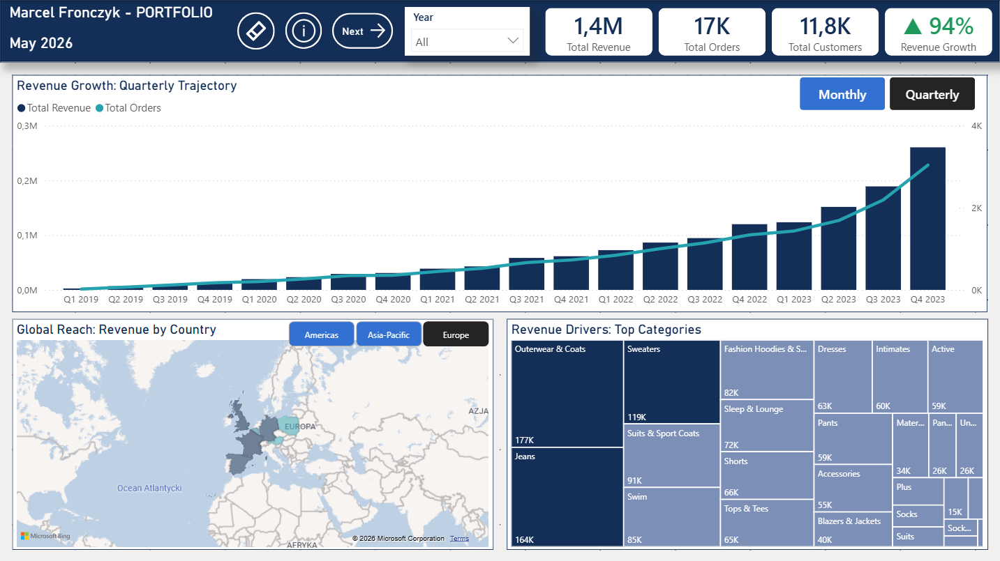

---

### Page 2 — Sales & Product

**Role:** Product economics. Which categories drive revenue vs margin, inventory health, order composition, price tier performance.

**KPI panel:** Total Revenue · Avg Margin % · Total Orders · Avg Order Value

**Main visuals (2×2 grid):**

- **TL — Inventory Health** — frozen capital by category, with old-stock highlighting. `REMOVEFILTERS(dimDate)` applied (stock is time-independent).
- **TR — Category Profitability** — scatter chart. X = Avg Margin %, Y = Revenue Share %, bubble size = Total Items Sold. **Custom tooltip page** surfaces Avg Margin %, Revenue Share %, Total Items, Total Revenue per category on hover.
- **BL — Order Composition** — donut chart. Single-item vs multi-item orders breakdown.
- **BR — Price Bucket** — bar chart. Volume vs revenue across price tiers ($0–19, $20–49, $50–99, $100–199, $200+).

**Interactions:** **Full mesh** — all 4 visuals cross-filter each other and KPIs. Behavioral segmentation reasoning: order composition (item count) and price bucket are *behavioral segments* (not pure operational state), so drill-down across visuals is analytically meaningful.

**Year slicer:** filters all visuals **except** Inventory Health (stock is a snapshot, not time-series).


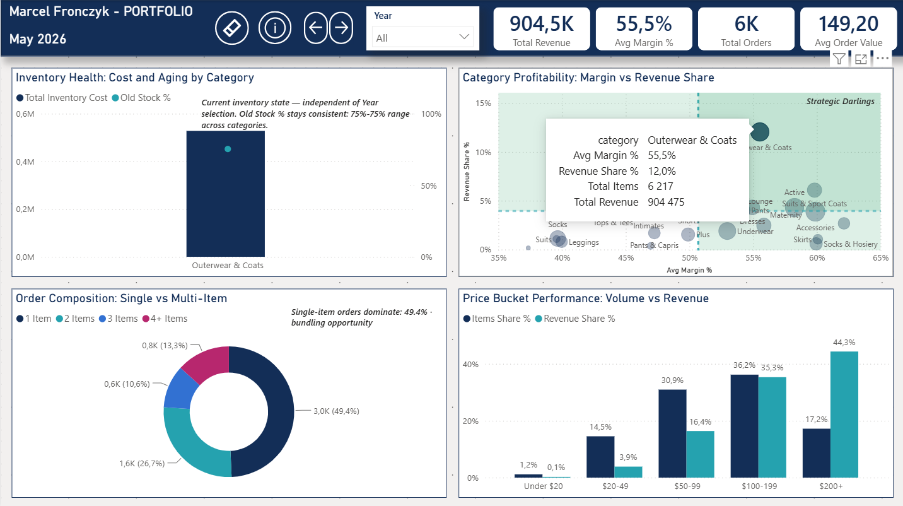

---

### Page 3 — Customer & Marketing

**Role:** Customer base structure. Demographics, value distribution, acquisition vs retention trends, channel performance.

**KPI panel:** Total Customers · Orders Per Client · Avg Item Price · Repeat Purchase %

**Main visuals (2×2 grid):**

- **TL — Total Customers by Demographic** — bar chart with **Field Parameter dropdown** (Age / Country / Gender). Switches the dimension without rebuilding the visual.
- **TR — Customer Pareto** — decile bar chart. **Static SQL output** structure (`decile_table`, no relationships) with **reactive measures** (% revenue, cumulative % revenue, decile revenue) sourced from `query_customer_revenue_year`. Year-reactive but peer-visual-isolated.
- **BL — Customer Retention** — stacked bar of new vs returning customers per year. **Static SQL output** (`query_customers`, no relationships) — fully isolated from any filter so the 5-year arc is always visible.
- **BR — Channel Performance** — bar chart of `Channel Revenue per $100` (decomposition measure, sums to $100 across channels). Search highlighted gold `#ED942D`, others deep navy `#132E57` via conditional formatting measure.

**Interactions:** TL ↔ BR bidirectional (cross-filter each other + KPIs). TR and BL **architecturally isolated** (no relationships to fact tables) — peer-visual clicks don't propagate to them, preserving their multi-year narratives by design.


---

### Page 4 — Operations

**Role:** Fulfillment efficiency and product quality. Delivery speed distribution, return rates by category, order lifecycle attrition, category-level operations health.

**KPI panel:** 4 operations-focused KPIs (Avg Delivery Time · Return Rate % · On-Time Delivery % · Inventory Turnover)

**Main visuals (2×2 grid):**

- **TL — Logistics Speed** — histogram of delivery day distribution at 1-day intervals (9 buckets, 0 through 8 days — Same Day = 0). Bars show **count of orders** delivered in each day bucket, not percentages. Dynamic annotation surfaces Same Day / Next Day percentages.
- **TR — Quality Signal** — bar chart of return rate by category. **TOP 15 / ALL toggle** (two separate buttons programmed via bookmarks) switches between focused view (15 worst-offending categories) and full distribution (all 26 categories).
- **BL — Fulfillment Funnel** — 5-step lifecycle (Placed → Confirmed → Dispatched → Delivered → Kept). **Custom tooltip page** shows Funnel Orders, % of First, % of Previous, Drop-off vs Previous per step.
- **BR — Operations Health Quadrant** — scatter chart. X = avg delivery time, Y = return rate %, bubble size = revenue share. Top-right quadrant = high-risk categories (slow + returns-heavy).

**Interactions:** TR and BR are dimensional sources (category) — Filter all peers + KPIs on click. TL and BL are value sources (delivery day buckets, funnel steps — operational state, not segmentation) — value clicks isolated, do not reshape other visuals.

**Year slicer:** filters all visuals via **surgical CROSSFILTER** in DAX measures (`orders`-based measures including delivery time, on-time %, same-day/next-day %, funnel orders).


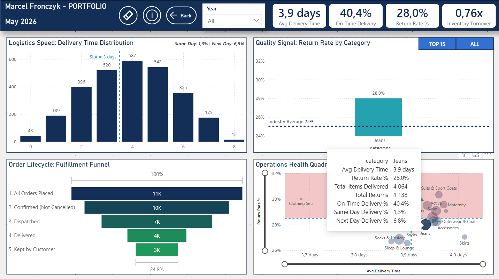

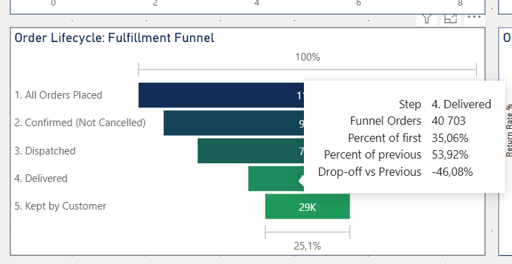

</details>

---

## Key Insights & Recommendations

<details>
<summary><strong>Strategic findings, operational findings, prioritized recommendations — click to expand</strong></summary>

<br>

### Strategic findings

1. **Wide-catalog multi-brand retailer with own inventory** — extreme long-tail product distribution (top 10 SKUs = 0.97% revenue), passive inventory aging ($2.1M frozen capital), channel-undifferentiated customer behavior. theLook is a long-tail aggregator carrying many brands, not a vertical D2C brand. Findings should be interpreted through multi-brand retailer economics (capital-at-risk in inventory, range vs depth trade-off), not vertical brand playbooks.

2. **Volume-driven growth, not premium pricing** — 238% revenue acceleration in 2020 sustained through 2023 with avg item price perfectly flat at $59–60. Growth was geographic and demographic breadth, not category mix upgrade or price action.

3. **Flat customer Pareto** — top 10% generates only 34.3% of revenue versus industry 50–60%. Revenue from breadth, not whales. Strategic implication: customer acquisition cost (CAC) optimization beats lifetime value (LTV) optimization for this business — get more mid-tier customers, don't try to over-extract from existing ones.

4. **CRM infrastructure gap** — 100K customers with emails on file, only 2,416 acquired via Email channel (the rest came through Search/Organic/Facebook/Display). No evidence of follow-up email campaigns to existing customer base. Largest untapped lever in the dataset. The fact that all channels show identical loyalty (1.39–1.41 orders/customer) confirms there's no CRM moat — competitors could match this with basic email marketing.

5. **Cross-departmental synthesis: one email program lifts three KPIs** — a single low-cost email intervention (discount codes, bundle offers) simultaneously addresses three structural problems each surfaced independently in different sections of this analysis: (1) the **76.6% one-time buyer rate** (Q9, Customer & Marketing) — discount codes incentivize return purchases, raising repeat-customer rate; (2) the **70.2% single-item order rate** (Q6, Sales & Product) — bundle offers drive multi-item baskets, raising AOV; (3) the **systemic inventory bloat** (Q5, Sales & Product — 21 of 26 categories with stock exceeding all-time revenue) — markdown/clearance promos move old collection stock, raising inventory turnover. **One channel, three departments, near-zero marginal cost.** This is why Email re-engagement is the #1 priority recommendation despite the channel's modest $4.98 per $100 current contribution to revenue.

### Operational findings

6. **Systemic inventory imbalance** — 21 of 26 categories show unsold stock cost exceeding their all-time revenue, aggregating to $8.85M unsold inventory against $7.5M cumulative revenue (118% ratio). Worst relative offenders: Socks (161%), Clothing Sets (153%), Suits (152%). Largest absolute frozen capital in Jeans ($1.14M) and Outerwear & Coats ($981K). Pattern is broad and structural, not category-specific. *(Absolute dollar amounts above are inflated by synthetic data — see Limitations. Focus on relative rankings between categories, not raw figures.)*

7. **Blazers & Jackets is the highest-ROI catalog expansion candidate** — quadruple-positive: highest margin in catalog (62.1%), lowest inventory-to-revenue ratio at 94.5% (best inventory health among 26 categories), top-5 revenue per SKU at $360, and limited catalog size (560 SKUs vs 1,400-2,000 for top-revenue categories). The 2.7% revenue share reflects supply ceiling more than demand weakness — each existing SKU generates more revenue than Sweaters, Active, or Fashion Hoodies per unit. Catalog expansion (SKU count) is the lever, not marketing spend on existing assortment. Conversely, **Clothing Sets and Suits are quadruple-negative**: bottom-tier on margin, inventory health, revenue, and catalog size simultaneously — clean discontinuation candidates rather than fixable opportunities.

8. **Multi-dimensional portfolio review across the broader catalog** — four-dimensional ranking (margin × inventory health × revenue share × catalog supply) sorts categories into four actionable cohorts:

   - **Strategic Darlings (winning at scale):** Outerwear & Coats (#1 revenue at 12.1% share, #1 revenue per SKU at $637 — most efficient catalog), Suits & Sport Coats (4th revenue at 6.1% share + 5th margin at 59.8% + 5th inventory health at 99.6% + #2 revenue per SKU at $620 — overlooked twin to Blazers but at 2× Blazers' revenue), Accessories (top-3 margin at 59.9% + top-3 inventory health at 98.7% across 1,556 SKUs).

   - **Catalog expansion candidates (high efficiency × low supply):** Blazers & Jackets ($360/SKU × 560 SKUs — high revenue per SKU constrained by limited catalog) and Suits & Sport Coats ($620/SKU × 738 SKUs — proven economics, room to scale further. Note: already a Strategic Darling above; expansion would scale proven performance, not bet on unproven demand).

   - **Discontinuation candidates (multiple weakness signals):** Clothing Sets (worst margin at 37.3%, near-worst inventory at 153%, smallest revenue at $12K, smallest catalog at 37 SKUs), Suits (39.6% margin × 152% inventory × small 188-SKU catalog), Leggings (40% margin × 144% inventory).

   Catalog hygiene observation: the catalog contains two distinct but confusable categories — `Suits` (188 SKUs, discontinuation candidate) and `Suits & Sport Coats` (738 SKUs, Strategic Darling). The dataset does not document what differentiates them, but the fact that one is a clear exit and the other a top performer reinforces the discontinuation case for `Suits` — rationalizing two confusable categories into the healthier one is itself a catalog hygiene win beyond the financial argument. The very existence of two confusable categories is a signal that one (`Suits`) may be a residual or duplicate worth eliminating.

   - **Activation candidate (operational weakness × strategic upside):** Socks (39.7% margin × 161% inventory × 1.13% revenue share) rank quadruple-negative on financial dimensions but have **strategic value as a bundling anchor** — low ticket size + universal applicability + cart-add psychology make them a natural lever for the 70.2% single-item order problem (Q6). Rather than immediate discontinuation, Socks should be tested as a bundling activation lever — they may serve the catalog better as an attached-purchase driver of AOV than as a standalone category.

   Portfolio rebalancing — even modest catalog expansion in 2-3 categories + decommissioning of 3-4 categories — could shift the revenue mix toward higher-margin, healthier-inventory profile without requiring net marketing spend increase.

   Note: this ranking deliberately excludes return rate. Inter-category differences are small (28.5% average across catalog; all categories within 25-31% range — see Finding #9), and elevated rates in formal categories (Suits, Suits & Sport Coats at 31%) likely reflect category-specific sizing difficulty (fit-driven returns common in formal wear) rather than quality differential. Return rate is therefore not a portfolio-differential signal for invest/exit decisions — it functions as a uniform category cost rather than a basis for cohort allocation.

9. **Quality signal across categories** — 28.5% overall return rate at the high end of industry range (20–30%); **every single category exceeds 25%**. Suits and Suits & Sport Coats lead at 31%. Combined with 39.6% Suits margin (low), clearance pricing is plausible explanation.

10. **No quality-logistics correlation** — categories distribute across the Operations Health Quadrant without a discernible "slow delivery → more returns" pattern. Returns are quality-driven (product fit, materials, expectations), not logistics-driven. Investment in faster delivery would not move return rates.

11. **Bundling opportunity** — 70.2% single-item orders. Cross-sell mechanics (recommended pairings, bundle discounts) underdeveloped. Cheaper to lift AOV via bundling than to acquire new customers.

### Prioritized recommendations

| # | Recommendation | Rationale | Effort |
|---|---|---|---|
| 1 | **Email re-engagement campaign with discount codes + bundle offers** | Activates the unused 97.6% of email-eligible customers; lifts three KPIs concurrently (repeat behavior, AOV via bundling, inventory turnover via markdowns) — see [Strategic Finding #5](#key-insights--recommendations). Lowest-cost intervention with broadest data-supported upside. | Low |
| 2 | **Discontinue Clothing Sets, Suits, Leggings** | All three show bottom-5 ranking on multiple dimensions simultaneously (margin, inventory health, revenue share, catalog size). Frozen capital won't recover via natural sales velocity. Clothing Sets is most clear-cut case (37 SKUs, 37.3% margin, 153% inventory). Suits discontinuation also rationalizes confusable category naming overlap with Suits & Sport Coats. | Medium |
| 3 | **Bundle promotion mechanics** | 70.2% single-item orders represent immediate AOV upside; cheaper than acquisition | Medium |
| 4 | **Catalog expansion in Blazers & Jackets and Suits & Sport Coats** | Both categories show high margin (62.1% / 59.8%) + healthy inventory (94.5% / 99.6%) + high revenue per SKU ($360 / $620), with limited catalog size relative to top-revenue categories. Lever is SKU count expansion (more product variants ordered), not marketing on existing assortment — supply ceiling currently caps revenue regardless of marketing intensity. | Medium |
| 5 | **Old-collection markdown event** | $1.14M frozen in Jeans, $981K in Outerwear & Coats — turn capital that's locked anyway; do not protect prices on stock that hasn't moved in 12+ months | Low |
| 6 | **Activate Socks as bundling anchor before discontinuation decision** | Despite financial weakness (39.7% margin × 161% inventory × 1.13% revenue), Socks have strategic value as a bundle item — low ticket size + universal applicability + cart-add psychology. Test bundling mechanics with Socks as anchor (cross-sell with apparel orders, free-with-bundle offers) for 2-3 quarters before discontinuation decision. May serve the catalog better as attached-purchase AOV driver than as standalone category. | Medium |

</details>

---

## Methodology & Conscious Decisions

<details>
<summary><strong>Architectural choices, conscious rejections, design conventions — click to expand</strong></summary>

<br>

This section documents **decisions that could have gone other ways**, with rationale. Every decision below was made deliberately, not by default.

### Architectural decisions

- **Dual-source measure convention (Total Orders, Total Customers)** — canonical version sources from dimension table (semantically correct, not Year-reactive); reactive version sources from fact table (`order_items`, propagates Year filter). Used where the same business entity needs to behave differently depending on filter context.
- **Surgical CROSSFILTER, not global bidirectional** — opened relationship direction inside `CALCULATE` per measure, kept relationships single-direction at model level. Tried global bidirectional once; it broke `AOV per traffic_source` on C&M by introducing ambiguity. Surgical is the good citizen pattern.
- **`REMOVEFILTERS(dimDate)` on inventory measures** — inventory is a point-in-time snapshot, not time-series. Year filter doesn't semantically apply. Applied to all stock-level measures + Inventory Health visual + Inventory Turnover denominator.
- **Static SQL outputs as architectural isolation tools** — three pre-aggregated tables (`decile_table`, `query_customers`, `query_customer_revenue_year`), each with a distinct relationship topology serving a specific visual behavior (fully isolated / Year-reactive but peer-isolated). Static loading via Get Data → Advanced, not DirectQuery.
- **`Date Only` calculated column in Power Query** — resolved `DATETIMEOFFSET` vs `Date` type mismatch when linking fact table to dimDate. Type matching is mandatory for Power BI relationships.
- **Continuous X-axis via Date column for Monthly Hero chart** — default text-typed `Year-Month` column forces Categorical axis, which couldn't fit 60 months on canvas (scrollbar problem). Added `Year-Month Date` calculated column (DATE first-of-month) enabling Continuous axis type — all 60 months auto-fit without scrollbar. Quarterly view (only 20 quarters) doesn't need this — Categorical with sort helper works fine.
- **Censored data principle for Return Rate** — denominator restricted to `Complete + Returned` (delivered orders), excluding `Shipped + Processing` which haven't entered the return-eligible state. Standard statistical practice when measuring rates of an event with a time lag.
- **Inventory analysis presented via relative ratios + absolute dollars, with caveat** — investigation revealed dataset synthetic limitations (total unsold inventory cost 118% of all-time revenue, implausibly high for a healthy growing retailer). Kept absolute dollar figures for executive dashboard readability but documented the data quality concern transparently in Limitations + flagged cross-category ratios as the robust analytical layer. This is a real-world tradeoff between presentation clarity and analytical precision.

### Visual & UX decisions

- **Narrative title pattern** — every page uses `Topic: Description vs Description` (e.g., "Channel Performance: Revenue Contribution vs Loyalty"). Conveys analytical framing in the title itself, not just the chart's data.
- **Color convention: dark = high revenue** — applied consistently across map (choropleth gradient) and treemap (top 3 deep navy, rest light navy). Cross-visual semantic consistency reduces cognitive load.
- **Pareto decile color split at 80% cumulative threshold** — on Customer Pareto TR, deciles 1-5 colored deep navy (collectively ~80% of cumulative revenue), deciles 6-10 light blue (remaining ~20%). Directly visualizes the Pareto principle as a color encoding: dark = vital few, light = trivial many. Reader sees the 80/20 split — and in this case the **flatter-than-industry shape** (where top decile alone generates only 34.3% vs industry 50-60%, requiring 5 deciles to reach 80%) — at a glance, without computing cumulative shares manually.
- **Gold accent (`#ED942D`) reserved for "highest" markers** — Search bar on Channel Performance (highest revenue contribution). Used sparingly so the attention signal stays sharp.
- **Sort by value descending, not alphabetical** — applied explicitly on the visual (not via bookmark) so it survives bookmark interactions. Executive convention: highest bar on the left, eye flow natural from most important to least.
- **Bookmark `Data` property = OFF for info panels** — keeps Display ON (textbox visibility) but doesn't touch slicer/filter state. Without this, info button clicks reverted Region tile slicer to stale state.
- **Reset Slicers (not "Clean View")** — clears only slicer selections, preserves visual cross-filter highlights. Tried converting to full "Clean View" (clear everything); marginal benefit didn't justify reopening finalized pages. Documented as design choice.
- **Custom tooltips on key analytical visuals** — Category Profitability (margin %, revenue share, items, revenue), Fulfillment Funnel (orders, % first, % previous, drop-off). Standard tooltips would show only the data point's primary metric; custom tooltips deliver the analytical context that makes the visual interpretable.
- **Field Parameters with SWITCH-based dynamic titles** — uses the Order column (numeric) in SWITCH, not the label column (composite key error workaround). Reusable Power BI pattern.

### Conscious rejections (things deliberately *not* done)

- **Global bidirectional cross-filter** — tested, broke other measures via ambiguity. Replaced with surgical CROSSFILTER.
- **DAX `RANKX` for Pareto deciles** — would require iteration over 100K customer rows. Replaced with pre-aggregated SQL `NTILE` output loaded as static table.
- **"Reset all" button (clear visual cross-filter highlights)** — semantic scope kept narrow (Reset Slicers only). Documented above.
- **Status filter = Complete only** — would systematically undercount older years due to stale Shipped/Processing artifacts. Expanded to `Complete + Shipped + Processing` for revenue, `Complete + Returned` for return rate.
- **Pure star schema with `distribution_centers` linked directly to fact** — would be semantically wrong (warehouse describes product origin, not sale event). Kept snowflake link via `products`.
- **Pareto bullet in Executive Overview info textbox** — scope discipline; Pareto is a C&M finding, info textboxes describe per-page content only. Even though the finding is exec-relevant, cross-page contamination of info panels would hurt navigation clarity.

</details>

---

## Limitations & Caveats

<details>
<summary><strong>What this analysis does not cover — click to expand</strong></summary>

<br>

Honest framing of where this project stops:

- **Synthetic dataset** — theLook eCommerce is a fictitious / generated dataset. Patterns may reflect data generation choices rather than real-world e-commerce dynamics. Specifically suspect:
  - **Avg delivery time of 3.9 days** is unrealistically fast for a globally distributed retailer (real benchmarks 5–10 days). Likely a data generation simplification.
  - **China dominance (34.6% revenue)** is atypical for a clothing e-commerce site of this generic profile. Could be synthetic geographic bias.
  - **Perfect price stability ($59–60) across 5 years** suggests no real inflation modeling, which would be unrealistic for 2019–2023 inclusive of COVID supply chain disruption.

- **Inventory cost values reflect synthetic dataset generation, not realistic retail dynamics** — total unsold inventory cost ($8.85M wholesale, ~$17.5M retail value at average markup) exceeds cumulative 5-year revenue ($7.5M), implying ~2.4 years of retail value sitting unsold. For a healthy retailer with 238% YoY growth, this is implausibly high — real benchmarks would suggest inventory-to-revenue ratios well below 40% across ALL categories combined. The synthetic generator likely created a baseline inventory pool (~17 units per SKU × 29K products = ~490K units) without modeling realistic depletion dynamics. **Absolute dollar inventory values are therefore suspect**; relative cross-category ratios (which categories are MORE vs LESS over-stocked) remain the analytically robust signal.

- **Data quality artifacts not removed** — 17% of `order_items` rows have `shipped_at < created_at`. Excluded from time-based analysis but kept in volume aggregates (decision documented). A production deployment would want this fixed at the data generation source.

- **No customer LTV / CAC analysis** — would require acquisition cost data (paid channel spend, organic acquisition cost imputation). Channel breakdown shows reach but not unit economics.

- **No predictive component** — pure descriptive analytics. No forecasting (e.g., 2024 revenue projection), no causal inference (e.g., "did the email channel cause repeat purchases or did repeat customers self-select into email"), no propensity modeling.

- **Category-level returns analysis only** — return rate is decomposed by category and gender but not by individual product. With 29K SKUs, product-level return analysis is feasible but adds noise without offsetting signal.

- **Inventory analysis is snapshot-based** — current stock as of dataset end. Historical inventory progression (how stock built up over time) not analyzed; would require event-sourced inventory deltas, which the dataset doesn't capture directly.

- **No real-time refresh** — Import mode means data is frozen at .pbix refresh time. A production deployment would need scheduled refresh or migration to DirectQuery (with the trade-offs documented above).

- **Static dashboard, no row-level security** — every viewer sees the same data. Real enterprise BI deployments typically restrict regional managers to their region, category leads to their categories, etc.

</details>

---

## Future Work

<details>
<summary><strong>Roadmap for v2 — click to expand</strong></summary>

<br>

- **Reconstruct exploratory SQL queries as `.sql` files** — during the analysis phase, queries were authored interactively in SSMS without persisted file artifacts. A future revision would extract the analytical patterns from chat history and dashboard measures, then publish them under `sql/` organized by department (`01_executive/`, `02_sales_product/`, etc.) for direct SQL skill demonstration without requiring viewers to open the .pbix file.

- **Cohort analysis page** — RFM segmentation (Recency, Frequency, Monetary), cohort survival curves, customer lifecycle stages. Would replace flat Pareto framing with a temporal customer journey lens.

- **Time series forecasting** — Power BI native forecast or Python integration (via Power Query Python script) to project 2024+ revenue, identify seasonal patterns, and quantify uncertainty bands.

- **Product-level return rate analysis** — drill below category to individual SKUs. Could surface specific defective products driving category-level signal.

- **Customer LTV / CAC modeling** — given acquisition cost assumptions, model expected lifetime revenue per channel and identify channels with positive unit economics.

- **Mobile / tablet layout optimization** — currently desktop-only layout. Power BI mobile view would benefit from a separate layout configuration for phone screens.

- **Bookmark-driven scenario comparison** — "what if we discontinued Jumpsuits?" toggle that shows revised inventory turnover, frozen capital, and revenue impact side by side with current state.

- **Talking points document** — interview prep manual similar to the one produced for the Job Market Intelligence project. Themed by 11 areas (project origin, data engineering, modeling, DAX patterns, dashboard UX, conscious rejections, etc.) with a quick-reference numbers cheat sheet.

</details>

---

## Repository Structure

```
ecommerce-analytics/
├── .gitignore
├── LICENSE                         # MIT License
├── README.md                       # This file
├── data/
│   ├── raw/                        # Original CSV files (preserved from recruit41/ecommerce-dataset, since removed)
│   │   ├── distribution_centers.csv
│   │   ├── inventory_items.csv
│   │   ├── order_items.csv
│   │   ├── orders.csv
│   │   ├── products.csv
│   │   └── users.csv
│   └── cleaned/                    # Post comma-in-name fixes (manual file-level cleanup before BULK INSERT)
│       ├── inventory_items.csv
│       └── products.csv
├── images/                         # 26 dashboard screenshots — page-level overviews + per-visual isolates
│   ├── executive-overview-1.png … executive-overview-6.png   (Executive Overview page + 4 visuals)
│   ├── sales-product-1.png … sales-product-6.png             (Sales & Product page + 4 visuals)
│   ├── customer-marketing-1.png … customer-marketing-8.png   (C&M page + 5 visuals incl. 3 Field Parameter states)
│   └── operations-1.png … operations-6.png                   (Operations page + 3 visuals; ops-2/3 used in Dashboard Tour for filter cascade + tooltip)
└── powerbi/
    └── ecommerce-dashboard.pbix    # Full interactive dashboard (21.9 MB, optimized from 53 MB initial)
```

---

## Acknowledgments

**Dataset** originally sourced from `recruit41/ecommerce-dataset` (GitHub), which mirrored the **theLook eCommerce** public dataset from Google BigQuery (`looker-private-demo.thelook_ecommerce`). The recruit41 repository has been removed (404 as of June 2026); this project preserves the dataset in `data/raw/` for reproducibility and to maintain the underlying data layer publicly accessible.

**Tooling:**
- **SQL Server 2025 Developer Edition** + **SSMS** — free local SQL environment
- **Power BI Desktop** — free dashboard authoring tool
- **Tabular Editor 2** (free) — measure dependency analysis and model inspection during development

**Methodological framing** inspired by publicly available content on building executive-driven data portfolios — specifically the discipline of starting from business questions rather than data exploration, treating README files as executive summaries, and documenting conscious decisions (including rejections) as portfolio talking points.

---

## Author

**Marcel Fronczyk**

Corporate finance consultant transitioning into data analytics / BI roles. This is Portfolio Project #2.

- GitHub: [github.com/marcelFRO](https://github.com/marcelFRO)
- Portfolio Project #1: [AI-Powered Job Market Intelligence](https://github.com/marcelFRO/ai-job-market-intelligence) — n8n + Apify + GPT-4o-mini + Power BI pipeline analyzing ~3,000 Polish data job offers
---
 
*This project is licensed under the MIT License — see [LICENSE](LICENSE) for details.*
